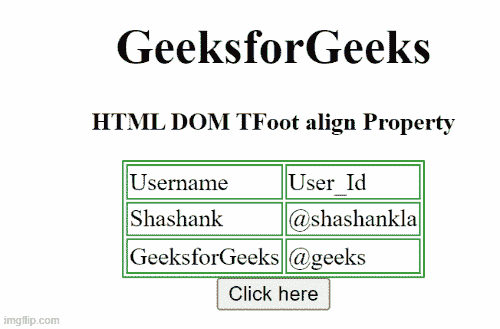

# HTML DOM TFoot 对齐属性

> 原文:[https://www . geesforgeks . org/html-DOM-tfoot-align-property/](https://www.geeksforgeeks.org/html-dom-tfoot-align-property/)

**HTML DOM TFoot align 属性**用于设置或返回 **<和>** 元素内内容的水平对齐。HTML 5 不支持。

**语法:**

```html
tfootObject.align = "left | right | center"
```

**属性值**

*   **左:**设置文本左对齐。
*   **右:**设置文本右对齐。
*   **居中:**设置文本居中对齐。
*   **对齐:**拉伸段落文本，使所有行的宽度相等。
*   **字符:**它将文本对齐设置为特定字符。

**返回值:**返回一个字符串值，代表< tfoot >元素的水平对齐方式。

**示例 1:** 下面的 HTML 代码说明了如何返回 TFoot align 属性。

## 超文本标记语言

```html
<!DOCTYPE html>
<html>

<head>
    <style>
        table,
        th,
        td {
            border: 1px solid green;
        }
    </style>
</head>

<body>
    <center>
        <h1>
           GeeksforGeeks
        </h1>

<p><b>HTML DOM TFoot align Property </b></p>

        <table>
            <thead>
                <tr>
                    <td>Username</td>
                    <td>User_Id</td>
                </tr>
            </thead>
            <tbody>
                <tr>
                    <td>Shashank</td>
                    <td>@shashankla</td>
                </tr>
                <tfoot id="GFG" align="left">
                    <tr>
                        <td>GeeksforGeeks</td>
                        <td>@geeks</td>
                    </tr>
                </tfoot>
            </tbody>
        </table>
        <button onclick="btnclick()"> Click here </button>
        <p id="paraID"></p>

        </center>
        <script>
            function btnclick() {
                var x = document.getElementById("GFG").align;
                document.getElementById("paraID").innerHTML = x;
            }
        </script>
</body>

</html>
```

**输出:**



**示例 2:** 下面的 HTML 代码说明了如何设置 TFoot align 属性。

## 超文本标记语言

```html
<!DOCTYPE html>
<html>

<head>
    <style>
        table,
        th,
        td {
            border: 1px solid green;
        }
    </style>
</head>

<body>
    <center>
        <h1>
            GeeksforGeeks
        </h1>

<p><b>HTML DOM TFoot align Property </b></p>

        <table>
            <thead>
                <tr>
                    <td>Username</td>
                    <td>User_Id</td>
                </tr>
            </thead>
            <tbody>
                <tr>
                    <td>Shashank</td>
                    <td>@shashankla</td>
                </tr>
                <tfoot id="GFG" align="left">
                    <tr>
                        <td>GeeksforGeeks</td>
                        <td>@geeks</td>
                    </tr>
                </tfoot>
            </tbody>
        </table>
        <button onclick="btnclick()"> Click here </button>
        <p id="paraID"></p>

        <script>
            function btnclick() {
                var x = document.getElementById("GFG").align = "right";
                document.getElementById("paraID").innerHTML = x;
            }
        </script>
</body>

</html>
```

**输出:**

