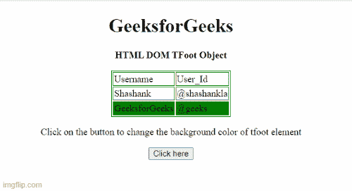

# html DOM tfoot 对象

> 原文:[https://www.geeksforgeeks.org/html-dom-tfoot-object/](https://www.geeksforgeeks.org/html-dom-tfoot-object/)

**HTML DOM tfoot** 对象用来表示 HTML strong < tfoot > 元素。 [< tfoot >](https://www.geeksforgeeks.org/html-tfoot-tag/) 对象用于对文档页脚部分的 HTML 表格内容进行分组。 [< tfoot >](https://www.geeksforgeeks.org/html-tfoot-tag/) 对象与 HTML 文档的 [<和>](https://www.geeksforgeeks.org/html-thead-tag/)[<t body>](https://www.geeksforgeeks.org/html-tbody-tag/)元素一起使用。现在< tfoot >对象已被弃用，不再使用。

**访问 tfoot 对象:**我们可以使用 [**getElementById()**](https://www.geeksforgeeks.org/html-dom-getelementbyid-method/) 方法轻松访问 tfoot 对象。

**语法:**

```html
document.getElementById() 
```

**示例 1:** 下面的 HTML 代码说明了如何更改< tfoot >元素的背景颜色。

## 超文本标记语言

```html
<!DOCTYPE html>
<html>

<head>
    <style>
        table,
        th,
        td {
            border: 1px solid green;
        }
    </style>
</head>

<body>
    <center>
        <h1>
            GeeksforGeeks
        </h1>

<p><b>HTML DOM TFoot Object </b></p>

        <table>
            <thead>
                <tr>
                    <td>Username</td>
                    <td>User_Id</td>
                </tr>
            </thead>
            <tbody>
                <tr>
                    <td>Shashank</td>
                    <td>@shashankla</td>
                </tr>
            <tfoot id="tfootID" bgcolor="green">
                <tr>
                    <td>GeeksforGeeks</td>
                    <td>@geeks</td>
                </tr>
            </tfoot>
            </tbody>
        </table>

<p>
            Click on the button to change the
            background color of tfoot element
        </p>

        <button onclick="btnclick()">
            Click here
        </button>
        <p id="paraID"></p>

    </center>

    <script>
        function btnclick() {
            var thead = document
                .getElementById("tfootID");

            thead.style.backgroundColor = "red";
        }
    </script>
</body>

</html>
```

**输出:**



**创建一个 tfoot 对象:**我们可以使用下面的方法轻松创建一个 tfoot 对象。

**语法:**

```html
document.createElement() 
```

**示例 2:** 下面的 HTML 代码用于使用 [**createElement()**](https://www.geeksforgeeks.org/html-dom-createelement-method/) 方法创建一个 tfoot 对象。

## 超文本标记语言

```html
<!DOCTYPE html>
<html>

<head>
    <style>
        table,
        th,
        td {
            border: 1px solid green;
        }
    </style>
</head>

<body>
    <center>
        <h1>
            GeeksforGeeks
        </h1>

        <h2>HTML DOM tfoot object</h2>

        <table id="tableID">
            <thead>
                <tr>
                    <td>Name</td>
                </tr>
            </thead>
            <tr>
                <td>Manas</td>
            </tr>
            <tr>
                <td>Hritik</td>
            </tr>
            </thead>
        </table>

<p>
            Click button to create tfoot element.
        </p>

        <button onclick="btnclick()">
            Click here
        </button>
    </center>

    <script>
        function btnclick() {

            /* Create tfoot element */
            var X = document.createElement("TFOOT");

            /* Create tr element */
            var Y = document.createElement("TR");

            /* Create td element */
            var Z = document.createElement("TD");

            Z.innerHTML = "Govind";
            Y.appendChild(Z);
            X.appendChild(Y);
            document.getElementById(
                "tableID").appendChild(X);
        }
    </script>
</body>

</html>
```

**输出:**


**支持的浏览器如下:**

*   Chrome 1.0
*   Edge 12.0
*   Firefox 1.0
*   Internet Explorer 5.5
*   歌剧 12.1
*   Safari 3.0