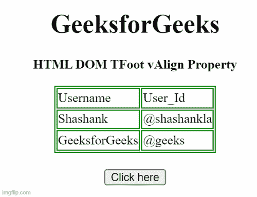

# HTML DOM TFoot vAlign 属性

> 原文:[https://www . geesforgeks . org/html-DOM-tfoot-valign-property/](https://www.geeksforgeeks.org/html-dom-tfoot-valign-property/)

***HTML DOM TFoot vAlign 属性*** 用于设置或返回 **< tfoot >** 元素的 vAlign 属性的值。vAlign 属性用于指定表格页脚元素中文本内容的垂直对齐方式。

**语法**

*   它返回 TFoot vAlign 属性。

```html
TFootobject.vAlign;
```

*   它设置 TFoot vAlign 属性。

```html
TFootobject.vAlign = "top|middle|bottom|baseline";
```

**属性值:**

*   **顶部**:将内容设置为顶部对齐。
*   **中:**将内容设置为中对齐。
*   **底部:**它将内容设置为底部对齐。
*   **基线**:将上下文设置为基线。基线是大多数角色所处的位置。

**返回值:**返回一个代表<元素垂直对齐的字符串值。

**示例 1:** 下面的 HTML 代码说明了如何返回 TFoot vAlign 属性。

## 超文本标记语言

```html
<!DOCTYPE html>
<html>

<head>
    <style>
        table,
        th,
        td {
            border: 1px solid green;
        }
    </style>
</head>

<body>
    <center>
        <h1>
            GeeksforGeeks
        </h1>

<p><b>HTML DOM TFoot vAlign Property</b></p>

        <table>
            <thead>
                <tr>
                    <td>Username</td>
                    <td>User_Id</td>
                </tr>
            </thead>
            <tbody>
                <tr>
                    <td>Shashank</td>
                    <td>@shashankla</td>
                </tr>
            </tbody>
            <tfoot id="GFG" align="left" valign="top">
                <tr>
                    <td>GeeksforGeeks</td>
                    <td>@geeks</td>
                </tr>
            </tfoot>
        </table>
        <br>
        <button onclick="btnclick()">
            Click here
        </button>
        <p id="paraID"></p>

    </center>

    <script>
        function btnclick() {
            var x = document.getElementById("GFG").vAlign;
            document.getElementById("paraID").innerHTML = x;
        }
    </script>
</body>

</html>
```

**输出:**



**示例 2:** 下面的代码说明了如何设置 TFoot vAlign 属性。

## 超文本标记语言

```html
<!DOCTYPE html>
<html>

<head>
    <style>
        table,
        th,
        td {
            border: 1px solid green;
        }
    </style>
</head>

<body>
    <center>
        <h1>
            GeeksforGeeks
        </h1>

<p><b>HTML DOM TFoot vAlign Property </b></p>

        <table>
            <thead>
                <tr>
                    <td>Username</td>
                    <td>User_Id</td>
                </tr>
            </thead>

            <tbody>
                <tr>
                    <td>Shashank</td>
                    <td>@shashankla</td>
                </tr>
            </tbody>
            <tfoot id="GFG" align="left" valign="top">
                <tr>
                    <td>GeeksforGeeks</td>
                    <td>@geeks</td>
                </tr>
            </tfoot>
        </table>
        <br>
        <button onclick="btnclick()">
            Click here
        </button>
        <p id="paraID"></p>

    </center>
    <script>
        function btnclick() {
            var x = document.getElementById(
                "GFG").vAlign = "baseline";

            document.getElementById(
                "paraID").innerHTML = x;
        }
    </script>
</body>

</html>
```

**输出:**


**支持的浏览器:**

*   谷歌 Chrome
*   火狐浏览器
*   微软公司出品的 web 浏览器
*   歌剧
*   苹果 Safari