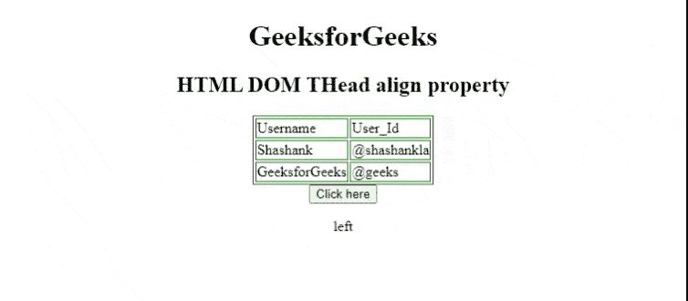
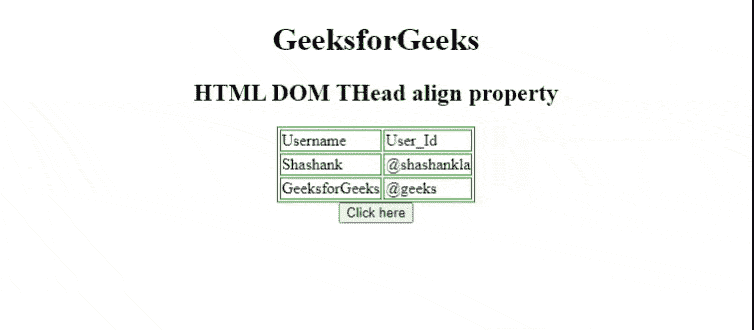

# HTML DOM 对齐属性

> 原文:[https://www . geesforgeks . org/html-DOM-the ad-align-property/](https://www.geeksforgeeks.org/html-dom-thead-align-property/)

**HTML DOM 属性用于设置或返回 [<和>](https://www.geeksforgeeks.org/html-thead-tag/) 元素中内容的水平对齐方式。HTML 5 不支持。**

**语法:**

*   它返回*对齐*属性。

    ```html
    theadobject.align
    ```

*   它设置*对齐*属性。

    ```html
    theadObject.align = "left | right | center"
    ```

**属性值:**

*   **左:**将文本设置为左对齐。
*   **右:**设置文本右对齐。
*   **居中**:设置文本居中对齐。
*   **对齐:**拉伸段落文本，使所有行的宽度相等。
*   **字符:**它将文本对齐设置为特定字符。

**返回值:**返回一个代表<和>元素对齐的字符串值。

**示例 1:** 下面的 HTML 代码说明了如何返回 ThAD*align*属性。

## 超文本标记语言

```html
<!DOCTYPE html>
<html>

<head>
    <style>
        table,
        th,
        td {
            border: 1px solid green;
        }
    </style>
</head>

<body>
    <center>
    <h1>
        GeeksforGeeks
    </h1>
    <h2>HTML DOM THead align property</h2>
    <table>
        <thead id="theadID" align="left">
            <tr>
                <td>Username</td>
                <td>User_Id</td>
            </tr>
        </thead>
        <tbody>
            <tr>
                <td>Shashank</td>
                <td>@shashankla</td>
            </tr>
            <tr>
                <td>GeeksforGeeks</td>
                <td>@geeks</td>
            </tr>
        </tbody>
    </table>
    <button onclick="btnclick()"> 
       Click here 
    </button>
    <p id="paraID"></p>
    <script>
        function btnclick() {
            var thead = document.getElementById("theadID").align;
            document.getElementById("paraID").innerHTML = thead;
        }
    </script>
</body>

</html>
```

**输出:**



**示例 2:** 下面的代码说明了如何将 THead 设置为*对齐*属性。

## 超文本标记语言

```html
<!DOCTYPE html>
<html>

<head>
    <style>
        table,
        th,
        td {
            border: 1px solid green;
        }
    </style>
</head>

<body>
    <center>
    <h1>
        GeeksforGeeks
    </h1>
    <h2>HTML DOM THead align property </h2>
    <table>
        <thead id="theadID" align="left">
            <tr>
                <td>Username</td>
                <td>User_Id</td>
            </tr>
        </thead>
        <tbody>
            <tr>
                <td>Shashank</td>
                <td>@shashankla</td>
            </tr>
            <tr>
                <td>GeeksforGeeks</td>
                <td>@geeks</td>
            </tr>
        </tbody>
    </table>
    <button onclick="btnclick()"> 
      Click here 
    </button>
    <p id="paraID"></p>
    <script>
        function btnclick() {
            var thead = document.getElementById(
                "theadID").align = "right";

            document.getElementById(
                "paraID").innerHTML = thead;
        }
    </script>
</body>

</html>
```

**输出:**



**支持的浏览器:**

*   谷歌 Chrome
*   微软公司出品的 web 浏览器
*   歌剧迷你
*   火狐浏览器
*   苹果 Safari