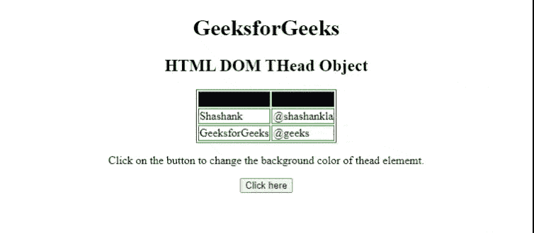
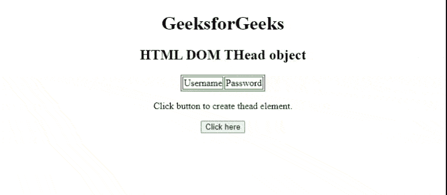

# 超文本标记语言 DOM 对象

> 原文:[https://www.geeksforgeeks.org/html-dom-thead-object/](https://www.geeksforgeeks.org/html-dom-thead-object/)

[**HTML DOM**](https://www.geeksforgeeks.org/dom-document-object-model/)**对象用于表示 HTML [<和>](https://www.geeksforgeeks.org/html-thead-tag/) 元素。它有助于引用访问 HTML 文档中的<和>元素。**

****访问一个目标对象:****

**通过使用[***HTML*****getElementById()**](https://www.geeksforgeeks.org/html-dom-getelementbyid-method/)方法，我们可以轻松访问文档中的一个 [<和>元素。](https://www.geeksforgeeks.org/html-thead-tag/)**

****语法:****

```html
document.getElementById()
```

****示例 1:** 下面的 HTML 代码说明了如何更改 [<和>](https://www.geeksforgeeks.org/html-thead-tag/) 元素的 [bgcolor](https://www.geeksforgeeks.org/html-bgcolor-attribute/) 。**

## **超文本标记语言**

```html
<!DOCTYPE html>
<html>

<head>
    <style>
        table,
        th,
        td {
            border: 1px solid green;
        }
    </style>
</head>

<body>
    <center>
    <h1>
        GeeksforGeeks
    </h1>
    <p><b>HTML DOM THead Object </b></p>
    <table>
        <thead id="tableID" bgcolor="43e">
            <tr>
                <td>Username</td>
                <td>User_Id</td>
            </tr>
        </thead>
        <tbody>
            <tr>
                <td>Shashank</td>
                <td>@shashankla</td>
            </tr>
            <tr>
                <td>GeeksforGeeks</td>
                <td>@geeks</td>
            </tr>
        </tbody>
    </table>
    <p>
        Click on the button to change the 
        background color of thead element. 
    </p>
    <button onclick="btnclick()"> 
        Click here 
    </button>
    <p id="paraID"></p>
    </center>
    <script>
        function btnclick() {
            var thead = document.getElementById("tableID");
            thead.style.backgroundColor = "red";
        }
    </script>
</body>

</html>
```

****输出:****

****

****创建一个 THead 对象:**我们可以使用[**document . createelement()**](https://www.geeksforgeeks.org/html-dom-createelement-method/)方法创建一个 THead 对象。**

****语法:****

```html
document.createElement()
```

****例 2:****

## **超文本标记语言**

```html
<!DOCTYPE html>
<html>

<head>
    <style>
        table, th, td {
            border: 1px solid green;
        }
    </style>
</head>

<body>
   <center>
    <h1>
        GeeksforGeeks
    </h1>

    <h2>HTML DOM THead object</h2>

     <table id ="tableID">

     </table>
     <p>
        Click button to create thead element.
     </p>

    <button onclick="btnclick()">
        Click here
    </button> 

    <script>
        function btnclick() {
           /* Create thead element */
           var x = document.createElement("THEAD"); 
          /* Create tr element */
          var y = document.createElement("TR");
          /* Create td element */
          var z = document.createElement("TD");
          z.innerHTML = "Username"; 
          /* Create td element */
          var w = document.createElement("TD");
          w.innerHTML = "Password";
          y.appendChild(z);
          y.appendChild(w);
          x.appendChild(y);
          document.getElementById("tableID").appendChild(x);
        }        
    </script>
</body>
</html>                
```

****输出:****

****

****支持的浏览器:****

*   **谷歌 Chrome**
*   **微软公司出品的 web 浏览器**
*   **歌剧迷你**
*   **火狐浏览器**
*   **苹果 Safari**