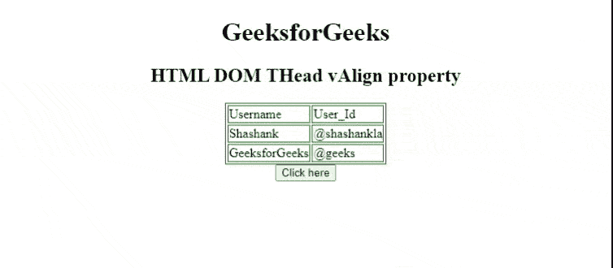
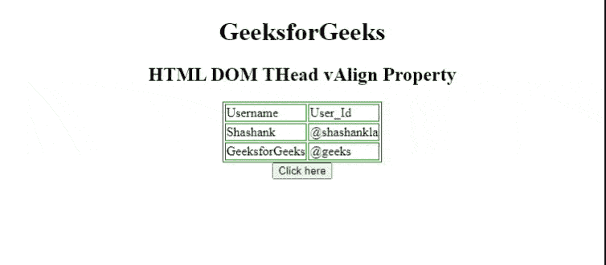

# HTML DOM 标签属性

> 原文:[https://www . geesforgeks . org/html-DOM-thead-valign-property/](https://www.geeksforgeeks.org/html-dom-thead-valign-property/)

属性用于设置或返回[**<>**](https://www.geeksforgeeks.org/html-thead-tag/)元素的 *valign* 属性的值。 *valign* 属性用于指定表格标题元素内文本内容的垂直对齐方式。

**语法**

*   它返回“日期”*值*属性。

```html
THeadobject.vAlign;
```

*   它设置了标记属性。

```html
THeadobject.vAlign = "top|middle|bottom|baseline";
```

**属性值:**

1.  **顶部:**它将内容设置为顶部对齐。
2.  **中:**将内容设置为中对齐。
3.  **底部**:将内容设置为底部对齐。
4.  **基线:**它将上下文设置为基线。基线是大多数角色所处的位置。

**返回值:**返回一个字符串值，代表<和>元素的垂直对齐。

**示例 1:** 下面的 HTML 代码说明了如何返回 ThAd*vAlign*属性。

## 超文本标记语言

```html
<!DOCTYPE html>
<html>

<head>
    <style>
        table,
        th,
        td {
            border: 1px solid green;
        }
    </style>
</head>

<body>
    <center>
    <h1>
        GeeksforGeeks
    </h1>
    <h2>HTML DOM THead vAlign property </h2>
    <table>
        <thead id="theadID" align="left" valign="top">
            <tr>
                <td>Username</td>
                <td>User_Id</td>
            </tr>
        </thead>
        <tbody>
            <tr>
                <td>Shashank</td>
                <td>@shashankla</td>
            </tr>
            <tr>
                <td>GeeksforGeeks</td>
                <td>@geeks</td>
            </tr>
        </tbody>
    </table>
    <button onclick="btnclick()">
        Click here
    </button>
    <p id="paraID"></p>

    </center>
    <script>
        function btnclick() {
            var thead = document.getElementById("theadID").vAlign;
            document.getElementById("paraID").innerHTML = thead;
        }
    </script>
</body>

</html>
```

**输出:**



**示例 2:** 下面的 HTML 代码说明了如何设置标签*标签*属性。

## 超文本标记语言

```html
<!DOCTYPE html>
<html>

<head>
    <style>
        table,
        th,
        td {
            border: 1px solid green;
        }
    </style>
</head>

<body>
    <center>
    <h1>
        GeeksforGeeks
    </h1>
    <h2>HTML DOM THead vAlign Property </h2>
    <table>
        <thead id="theadID" align="left" valign="top">
            <tr>
                <td>Username</td>
                <td>User_Id</td>
            </tr>
        </thead>
        <tbody>
            <tr>
                <td>Shashank</td>
                <td>@shashankla</td>
            </tr>
            <tr>
                <td>GeeksforGeeks</td>
                <td>@geeks</td>
            </tr>
        </tbody>
    </table>
    <button onclick="btnclick()">
       Click here
    </button>
    <p id="paraID"></p>

    <script>
        function btnclick() {
            var thead = document.getElementById(
                "theadID").vAlign = "bottom";

            document.getElementById(
                "paraID").innerHTML = thead;
        }
    </script>
</body>

</html>
```

**输出:**



**支持的浏览器:**

*   谷歌 Chrome
*   微软公司出品的 web 浏览器
*   歌剧迷你
*   火狐浏览器
*   苹果 Safari