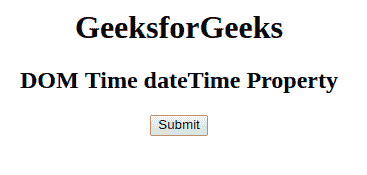
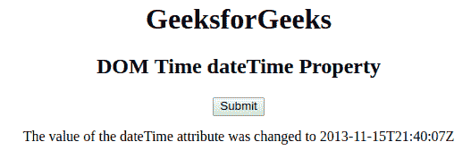
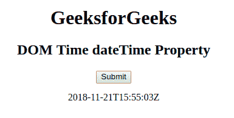

# HTML | DOM 时间日期时间属性

> 原文:[https://www . geesforgeks . org/html-DOM-time-datetime-property/](https://www.geeksforgeeks.org/html-dom-time-datetime-property/)

**DOM 时间日期时间属性**用于**设置**或**返回 **<时间>** 元素的日期时间属性的值。日期时间以格式 **YYYY-MM-DDThh:mm:ssTZD** 插入。**

**语法:**

*   它用于返回日期时间属性。

    ```html
    timeObject.dateTime
    ```

*   It is used to set the dateTime property.

    ```html
    timeObject.dateTime = YYYY -MM-DDThh:mm:ssTZD
    ```

    **属性值:**

    *   **YYYY-MM-DDThh:MM:ssTZD**YYYY-MM-DDThh:MM:ssTZD 它指定日期和时间。

    **说明:**

    *   **YYYY**–年份(如 2009 年)
    *   **月**–月(如 01 代表 1 月)
    *   **日**–一个月中的某一天(例如 04)
    *   **T**–所需的分离器
    *   **hh**–小时(例如晚上 8 点 20 分)
    *   **毫米**–分钟(例如 35)
    *   **ss**–秒(例如 09)
    *   **TZD**–时区指示器(Z 表示祖鲁语，也称为格林威治标准时间)

    **返回值:**返回表示日期和时间的字符串值。

    **示例-1:** 本示例设置日期时间属性。

    ```html
    <!DOCTYPE html>
    <html>

    <head>
        <title>
            HTML DOM Time dateTime Property
        </title>
    </head>

    <body style="text-align:center;">
        <h1>GeeksforGeeks</h1>

        <h2>
        DOM Time dateTime Property
    </h2>

        <p>
            <time id="GFG" 
                  datetime="2018-11-21T15:55:03Z">
            </time>
        </p>

        <button onclick="myGeeks()">
            Submit
        </button>

        <p id="sudo"></p>

        <script>
            function myGeeks() {
                var g = document.getElementById(
                    "GFG").dateTime = "2013-11-15T21:40:07Z";

                document.getElementById("sudo").innerHTML =
                    "The value of the dateTime attribute was changed to "
                + g;
            }
        </script>

    </body>

    </html>
    ```

    **输出:**
    **点击按钮前:**
    

    **点击按钮后:**
    

    **示例-2:** 本示例返回日期时间属性。

    ```html
    <!DOCTYPE html>
    <html>

    <head>
        <title>
            HTML DOM Time dateTime Property
        </title>

    </head>

    <body style="text-align:center;">
        <h1>
        GeeksforGeeks
    </h1>

        <h2>
        DOM Time dateTime Property
    </h2>

        <time id="GFG" 
              datetime="2018-11-21T15:55:03Z">
        </time>

        <button onclick="myGeeks()"> 
          Submit
      </button>

        <p id="sudo"></p>

        <script>
            function myGeeks() {
                var g = 
                    document.getElementById(
                      "GFG").dateTime;

                document.getElementById(
                  "sudo").innerHTML = g;
            }
        </script>

    </body>

    </html>
    ```

    **输出:**
    **点击按钮前:**
    

    **点击按钮后:**
    

    **支持的浏览器:**只有**火狐**是支持 **DOM Time dateTime 属性**的浏览器。