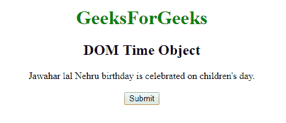
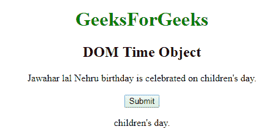
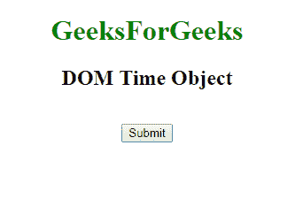
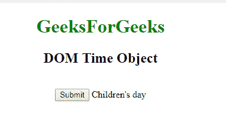

# HTML | DOM 时间对象

> 原文:[https://www.geeksforgeeks.org/html-dom-time-object/](https://www.geeksforgeeks.org/html-dom-time-object/)

**DOM 时间对象**用于表示 HTML [时间](https://www.geeksforgeeks.org/html-time-tag/)元素。*时间*元素由 **getElementById()** 访问。
**属性:**

*   [**dateTime:**](https://www.geeksforgeeks.org/html-dom-time-datetime-property/) 它包含单属性 dateTime，用于以元素的机器可读形式设置或返回日期/时间。

**语法:**

```html
document.getElementById("ID");
```

其中**“id”**是分配给**“时间”**标签的 ID。
**例-1:**

## 超文本标记语言

```html
<!DOCTYPE html>
<html>

<head>
    <title>DOM Time Object</title>
    <style>
        body {
            text-align: center;
        }

        h1 {
            color: green;
        }
    </style>
</head>

<body>
    <h1>GeeksForGeeks</h1>
    <h2>DOM Time Object</h2>
     Jawahar lal Nehru birthday is celebrated on
    <!--  Assigning id to time tag.  -->
    <time Id="GFG" datetime="2018--11-14 12:00">
      children's day.
    </time>
    <br>
    <br>

    <button onclick="myGeeks()">Submit</button>
    <p id="sudo"></p>

    <script>
        function myGeeks() {
            var g = document.getElementById("GFG").innerHTML;
            document.getElementById("sudo").innerHTML = g;
        }
    </script>
</body>

</html>
```

**输出:**
**点击按钮前:**



**点击按钮后:**



**示例-2:** *<时间>* 可以使用 **document.createElement** 方法创建对象。

## 超文本标记语言

```html
<!DOCTYPE html>
<html>

<head>
    <title>DOM Time Object</title>
    <style>
        body {
            text-align: center;
        }

        h1 {
            color: green;
        }
    </style>
</head>

<body>
    <h1>GeeksForGeeks</h1>
    <h2>DOM Time Object</h2>
    <br>
    <button onclick="myGeeks()">Submit</button>
    <script>
        function myGeeks() {

            // time tag created
            var g =
             document.createElement("TIME");

            g.setAttribute(
            "datetime", "2018--11-14 12:00");

            var f =
            document.createTextNode("Children's day");

            g.appendChild(f);

            document.body.appendChild(g);

        }
    </script>
</body>

</html>
```

**输出:**
**点击按钮前:**



**点击按钮后:**



**支持的浏览器:****DOM 时间对象**支持的浏览器如下:

*   谷歌 Chrome
*   微软公司出品的 web 浏览器
*   火狐浏览器
*   歌剧
*   旅行队