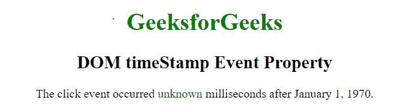
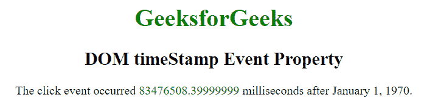

# HTML | DOM 时间戳事件属性

> 原文:[https://www . geesforgeks . org/html-DOM-timestamp-event-property/](https://www.geeksforgeeks.org/html-dom-timestamp-event-property/)

**时间戳**事件属性用于获取特定事件创建时的时间戳。它基本上返回浏览器创建的事件时间和 1970 年 1 月 1 日之间的时间差(以毫秒为单位)。

它是只读属性。

**语法:**

```html
event.timeStamp
```

**返回值:**:此事件返回自 1970 年 1 月 1 日起，事件触发时的毫秒数。

**示例:**

```html
<!DOCTYPE html>
<html>
    <head>
        <title>DOM timeStamp Event Property</title>
    </head>

    <body onwheel="Geeks(event)" 
          style="text-align:center">

        <h1 style="color: green;">
            GeeksforGeeks
        </h1>

        <h2>DOM timeStamp Event Property</h2>

        <p onclick="Geeks(event)">
            The click event occurred 
            <span id = "s" style="color:green">
                unknown
            </span> 
            milliseconds after January 1, 1970.
        </p> 

        <script>
            function Geeks(event) {
                var doc = event.timeStamp;
                document.getElementById("s").innerHTML = doc;
            }
        </script>
    </body>
</html>                    
```

**输出:**
**点击段落前:**

**点击段落后:**

**支持的浏览器:**timeStamp Event 属性支持的浏览器如下:

*   苹果 Safari
*   谷歌 Chrome
*   火狐浏览器
*   歌剧
*   Internet Explorer 9.0