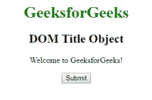
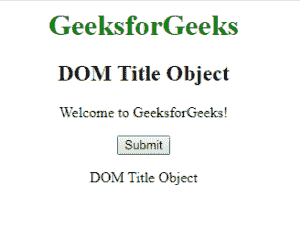
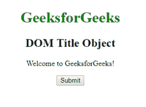
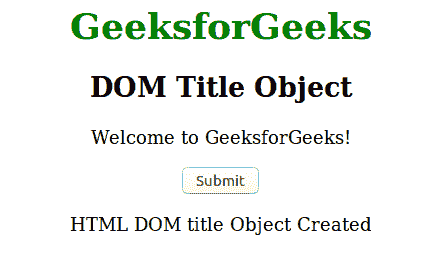

# HTML | DOM 标题对象

> 原文:[https://www.geeksforgeeks.org/html-dom-title-object/](https://www.geeksforgeeks.org/html-dom-title-object/)

HTML DOM 中的**标题对象**用来表示 HTML <标题>元素。使用 getElementByTagName()方法可以访问<标题>元素。
**语法:**

```html
document.getElementByTagName();
```

**属性:**title 对象包含单个属性 [**文本**](https://www.geeksforgeeks.org/html-dom-title-text-property/?ref=rp) ，用于设置或返回文档标题的文本或内容。
**例 1:**

## 超文本标记语言

```html
<!DOCTYPE html>
<html>
    <head>
        <title>
            DOM Title Object
        </title>
    </head>

    <body style = "text-align:center;">

        <h1 style = "color:green;">
            GeeksforGeeks
        </h1>

        <h2>DOM Title Object</h2>

<p>Welcome to GeeksforGeeks!</p>

        <button onclick = "myGeeks()">
            Submit
        </button>

        <p id = "sudo"></p>

        <!-- script to display tag name -->
        <script>
            function myGeeks() {
                var g = document.getElementsByTagName("TITLE")[0].text;
                document.getElementById("sudo").innerHTML = g;
            }
        </script>
    </body>
</html>                               
```

**输出:**
**之前点击按钮:**



**点击按钮后:**



**示例 2:** 可以使用 document.createElement 方法创建 Title 对象。

## 超文本标记语言

```html
<!DOCTYPE html>
<html>

<head>
</head>

<body style = "text-align:center;">

    <h1 style = "color:green;">
        GeeksforGeeks
    </h1>

    <h2>DOM Title Object</h2>

<p>Welcome to GeeksforGeeks!</p>

    <button onclick ="myGeeks()">
        Submit
    </button>

    <p id = "sudo"></p>

    <script>
        function myGeeks() {
            var tit_ele = document.createElement("TITLE");
            var obj = document.createTextNode("HTML DOM Objects");
            tit_ele.appendChild(obj);
            document.head.appendChild(tit_ele);

            document.getElementById("sudo").innerHTML
                    = "HTML DOM title Object Created";
        }
    </script>
</body>

</html>                                            
```

**输出:**
**之前点击按钮:**



**点击按钮后:**



**支持的浏览器:***DOM Title 对象*支持的浏览器如下:

*   谷歌 Chrome
*   微软公司出品的 web 浏览器
*   火狐浏览器
*   旅行队
*   歌剧