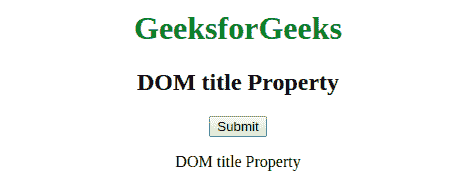
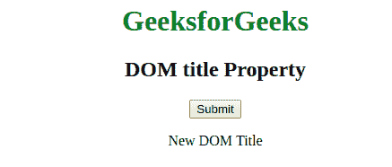

# HTML | DOM 标题属性

> 原文:[https://www.geeksforgeeks.org/html-dom-title-property/](https://www.geeksforgeeks.org/html-dom-title-property/)

**DOM title 属性**用于返回 HTML 文档的标题，也用于设置文档中标题的值。此属性用于指定有关标题的信息。
**语法:**

*   用于返回标题属性

```html
document.title
```

*   用于设置标题属性

```html
document.title = newTitle
```

**属性:**DOM title 属性包含一个新标题的值，用于返回文档的标题。
**返回值:**返回一个字符串值，代表元素的值标题。

**例 1:**

## 超文本标记语言

```html
<!DOCTYPE html>
<html>
    <head>
        <title>DOM title Property</title>
        <style>
            h1 {
                color:green;
            }
            body {
                text-align:center;
            }
        </style>
    </head>
    <body>
        <h1>GeeksforGeeks</h1>
        <h2>DOM title Property</h2>
        <button onclick="geeks()">Submit</button>
        <p id="sudo"></p>

        <script>
        function geeks() {
            var x = document.title;
            document.getElementById("sudo").innerHTML = x;
        }
        </script>
    </body>
</html>                   
```

**输出:**



**例 2:**

## 超文本标记语言

```html
<!DOCTYPE html>
<html>
    <head>
        <title>DOM title Property</title>
        <style>
            h1 {
                color:green;
            }
            body {
                text-align:center;
            }
        </style>
    </head>
    <body>
        <h1>GeeksforGeeks</h1>
        <h2>DOM title Property</h2>
        <button onclick="geeks()">Submit</button>
        <p id="sudo"></p>

        <script>
        function geeks() {
            document.getElementById("sudo").innerHTML =
                "New DOM Title";
        }
        </script>
    </body>
</html>                   
```

**输出:**



**支持的浏览器:***DOM title 属性*支持的浏览器如下:

*   谷歌 Chrome
*   微软公司出品的 web 浏览器
*   火狐浏览器
*   歌剧
*   旅行队