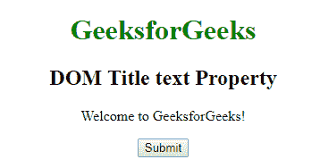
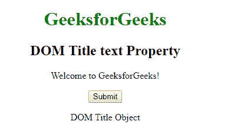
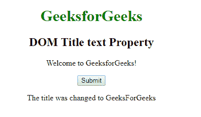

# HTML | DOM 标题文本属性

> 原文:[https://www.geeksforgeeks.org/html-dom-title-text-property/](https://www.geeksforgeeks.org/html-dom-title-text-property/)

**DOM 标题文本属性**用于**设置**或**返回** *文档标题的文本*。

**语法:**

*   它返回文本属性。

    ```html
    titleObject.text
    ```

*   它用于设置文本属性。

    ```html
    titleObject.text = text
    ```

**属性值:**包含用于指定文档标题文本的值，即**文本**。

**返回值:**返回代表文档标题文本的字符串值。

**示例-1:** 本示例**返回一个文本属性**。

```html
<!DOCTYPE html>
<html>

<head>
    <title>
        DOM Title text Property
    </title>
</head>

<body style="text-align:center;">

    <h1 style="color:green;"> 
            GeeksforGeeks 
        </h1>

    <h2>
      DOM Title text Property
  </h2>

    <p>
      Welcome to GeeksforGeeks!
  </p>

    <button onclick="myGeeks()">
        Submit
    </button>

    <p id="sudo"></p>

    <!-- script to display tag
          name -->
    <script>
        function myGeeks() {
            var g = document.getElementsByTagName(
              "TITLE")[0].text;

            document.getElementById(
              "sudo").innerHTML = g;
        }
    </script>
</body>

</html>
```

**输出:**
**点击按钮前:**


**点击按钮后:**


**示例-2:** 本示例**设置文本属性**。

```html
<!DOCTYPE html>
<html>

<head>
    <title>
         DOM Title text Property
    </title>
</head>

<body style="text-align:center;">

    <h1 style="color:green;"> 
            GeeksforGeeks 
        </h1>

    <h2>
      DOM Title text Property
  </h2>

    <p>
      Welcome to GeeksforGeeks!
  </p>

    <button onclick="myGeeks()">
        Submit
    </button>

    <p id="sudo"></p>

    <!-- script to display tag name -->
    <script>
        function myGeeks() {
            var g =
                document.getElementsByTagName(
                  "TITLE")[0].text = "GeeksForGeeks";

            document.getElementById("sudo").innerHTML =
              "The title was changed to " + g;
        }
    </script>
</body>

</html>
```

**输出:**
**点击按钮前:**

**点击按钮后:**
