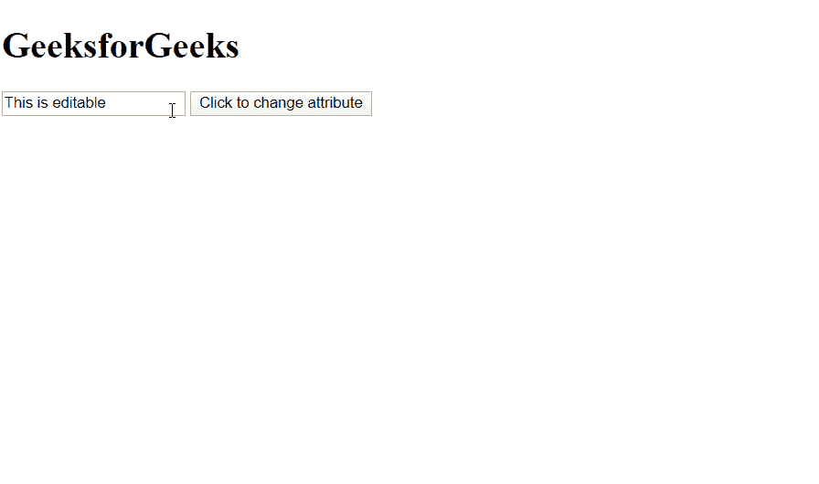

# HTML | DOM toggleAttribute()方法

> 原文:[https://www . geesforgeks . org/html-DOM-toggle attribute-method/](https://www.geeksforgeeks.org/html-dom-toggleattribute-method/)

元素接口的 **toggleAttribute()** 方法切换给定元素的布尔属性。使用此方法可以更改元素的属性。

**语法:**

```html
Element.toggleAttribute("attribute_name");

```

**参数:**

*   **属性的名称:**要切换的属性的名称。当在 HTML 文档中的 HTML 元素上调用 **toggleAttribute()** 时，属性名称会自动转换为所有小写。

**返回值:**如果属性名存在，则返回**真**，否则返回**假**。

**示例:**在本例中，我们将输入元素的属性切换为**只读**。当在 HTML 文档中的 HTML 元素上调用 **toggleAttribute()** 时，属性名称会自动转换为所有小写。

```html
<!DOCTYPE html>
<html lang="en">

<head>
    <meta charset="UTF-8">
    <title>ToggleAttribute</title>
    <script>

        function change() {
            var input = 
            document.querySelector("input");

            input.toggleAttribute("readonly");
        }
    </script>
</head>

<body>
    <h1>GeeksforGeeks</h1>
    <input class="input" 
        value="This is editable">

    <button onclick="change()">
        Click to change attribute
    </button>
</body>

</html>
```

**输出:**

在这个输出中，可以看到点击按钮后，输入元素的属性变为**“只读”**，因此变为**不可编辑**。



**支持的浏览器:**下面列出了 **DOM toggleAttribute()方法**支持的浏览器:

*   谷歌 Chrome
*   火狐浏览器
*   苹果 Safari
*   歌剧