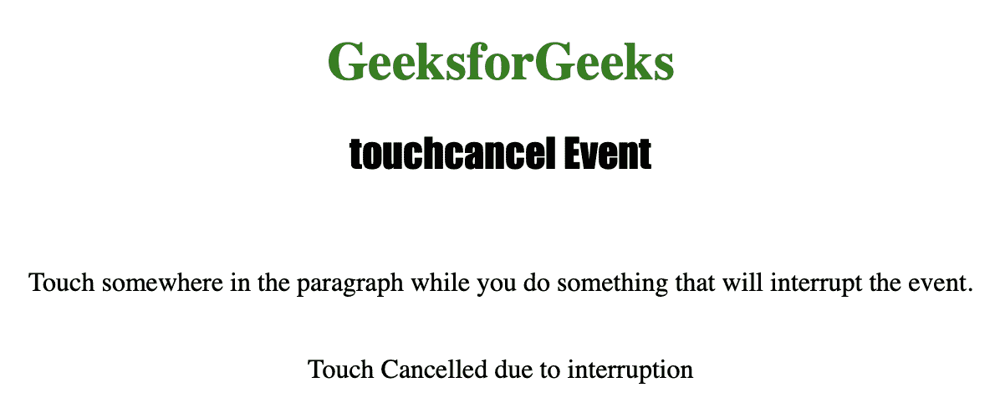

# HTML | DOM 触摸取消事件

> 原文:[https://www.geeksforgeeks.org/html-dom-touchcancel-event/](https://www.geeksforgeeks.org/html-dom-touchcancel-event/)

**触摸取消事件**用于在触摸事件中断时*执行脚本*。
如果*设备以不同的动作*中断触摸事件，则包括**触摸取消事件**来清除代码被认为是一种良好的做法。
**支持的标签**

*   此事件支持的所有 HTML 元素。

**支持的标签**

*   <details></details>

**语法:**

```html
object.ontouchcancel = myScript;
```

下面的程序说明了**触摸取消**事件:
**示例-1:** 在触摸中断时执行 JavaScript。

## 超文本标记语言

```html
<!DOCTYPE html>
<html>

<head>
    <title>touchcancel Event in HTML</title>
    <style>
        h1 {
            color: green;
        }

        h2 {
            font-family: Impact;
        }

        body {
            text-align: center;
        }
    </style>
</head>

<body>

    <h1>GeeksforGeeks</h1>
    <h2>touchcancel Event</h2>
    <br>

    <p ontouchcancel="cancel()">
      Touch somewhere in the paragraph while
      you do something that will interrupt the event.</p>

    <br>

    <p id="test"></p>

    <script>
        function cancel() {

            document.getElementById(
              "test").innerHTML =
              "Touch Cancelled due to interruption";
        }
    </script>

</body>

</html>
```

**输出:**
**触屏前:**


**触摸屏幕后:**



**支持的浏览器:**

*   微软公司出品的 web 浏览器
*   谷歌 Chrome
*   火狐浏览器