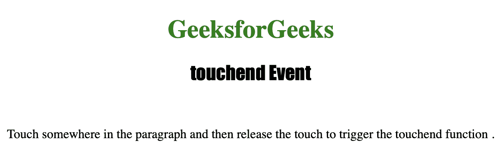
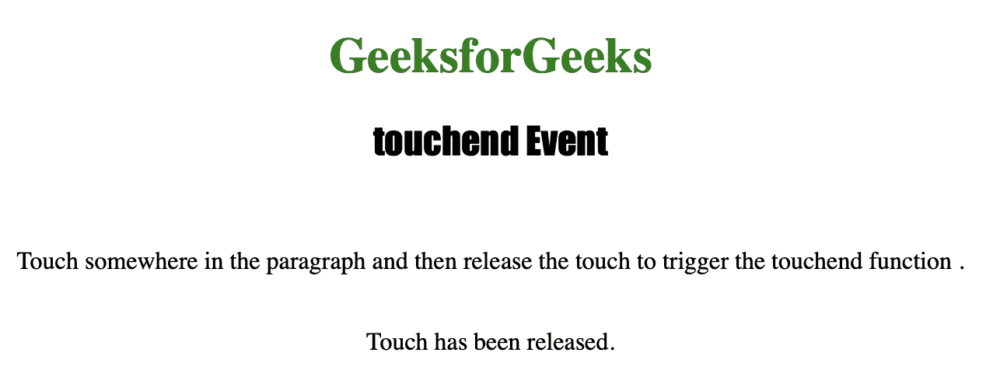

# HTML | DOM touchend 事件

> 原文:[https://www.geeksforgeeks.org/html-dom-touchend-event/](https://www.geeksforgeeks.org/html-dom-touchend-event/)

当用户将手指从元素上移开时，**触摸结束事件**用于*执行脚本*。它只能在带有触摸屏的设备上工作。

**支持的标签**

*   此事件支持的所有 HTML 元素。

**语法:**

```html
object.ontouchend = myScript;
```

下面的程序说明了触摸结束事件:
**示例-1:** 当用户释放触摸时执行 JavaScript。

## 超文本标记语言

```html
<!DOCTYPE html>
<html>

<head>
    <title>touchend Event in HTML</title>
    <style>
        h1 {
            color: green;
        }

        h2 {
            font-family: Impact;
        }

        body {
            text-align: center;
        }
    </style>
</head>

<body>

    <h1>GeeksforGeeks</h1>
    <h2>touchend Event</h2>
    <br>

    <p ontouchend="end()">
      Touch somewhere in the paragraph and then
      release the touch to trigger the touchend function.
  </p>

    <br>

    <p id="test"></p>

    <script>
        function end() {

            document.getElementById(
              "test").innerHTML =
              "Touch has been released.";
        }
    </script>

</body>

</html>
```

**输出:**
**触屏前:**



**触摸屏幕后:**



**支持的网络浏览器**

*   微软公司出品的 web 浏览器
*   谷歌 Chrome
*   火狐浏览器