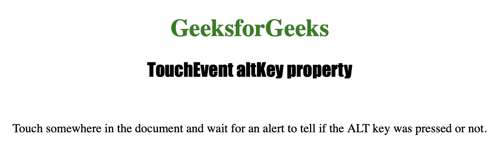
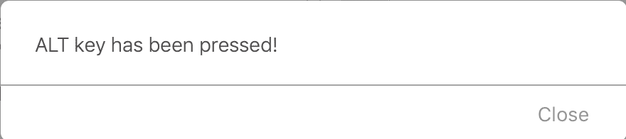

# HTML | DOM TouchEvent altKey 属性

> 原文:[https://www . geesforgeks . org/html-DOM-touch event-altkey-property/](https://www.geeksforgeeks.org/html-dom-touchevent-altkey-property/)

**触摸事件替代键**属性为只读属性，用于返回一个**布尔值**，该值指示在触发*触摸事件*时是否按下了“替代”键。
**touch event alt key**属性大多返回 *false* ，因为一般来说，触摸设备没有 alt 键。

**语法:**

```html
event.altKey
```

**返回值:**按 alt 键返回真，否则返回假。

下面的程序说明了 TouchEvent altKey 属性:

**示例:**查看触摸屏上是否按下了**“ALT”键**。

```html
<!DOCTYPE html>
<html>
<meta name="viewport" 
      content="width=device-width,
               initial-scale=1">

<head>
    <title>TouchEvent altKey property in HTML</title>

    <style>
        h1 {
            color: green;
        }

        h2 {
            font-family: Impact;
        }

        body {
            text-align: center;
        }
    </style>
</head>

<body ontouchstart="isKeyPressed(event)">

    <h1>GeeksforGeeks</h1>
    <h2>TouchEvent altKey property</h2>
    <br>

    <p>Touch somewhere in the document and wait for 
      an alert to tell if the ALT key was pressed or not.</p>

    <script>
        function count(event) {

            //  Check whether the ALT key has been pressed
            //  or not.
            if (event.altKey) {
                alert("ALT key has been pressed!");
            } else {
                alert("ALT key has not been pressed!");
            }
        }
    </script>

</body>

</html>
```

**输出:**

*   **点击按钮前:**
    
*   **点击按钮后:**
    

**支持的浏览器:**

*   微软公司出品的 web 浏览器
*   谷歌 Chrome
*   火狐浏览器