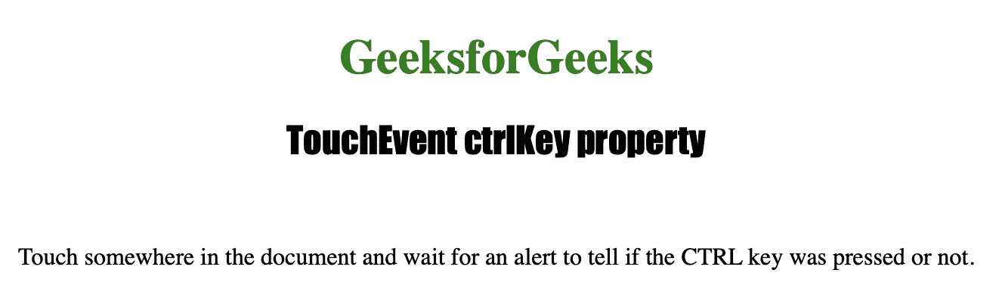
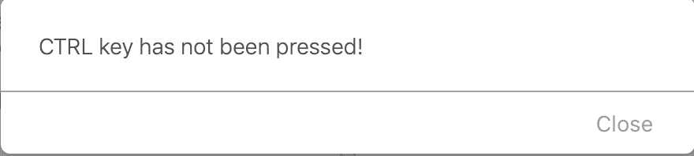

# HTML | DOM TouchEvent ctrlKey 属性

> 原文:[https://www . geesforgeks . org/html-DOM-touch event-ctrl key-property/](https://www.geeksforgeeks.org/html-dom-touchevent-ctrlkey-property/)

**触摸事件 ctrlKey** 属性是只读属性，用于返回一个**布尔值**，该值指示当触摸事件被触发时是否按下了*“CTRL”键*。它通常返回 false，因为一般来说，触摸设备没有 ctrl 键。

**语法:**

```html
event.ctrlKey
```

**返回值:**按下 **ctrl** 键返回*真*，否则返回*假*。

下面的程序说明了 TouchEvent ctrlKey 属性:
**示例:**找出触摸屏上是否按了“CTRL”键。

```html
<!DOCTYPE html>
<html>
<meta name="viewport" 
      content="width=device-width,
               initial-scale=1">

<head>
    <title>TouchEvent ctrlKey property in HTML
    </title>

    <style>
        h1 {
            color: green;
        }

        h2 {
            font-family: Impact;
        }

        body {
            text-align: center;
        }
    </style>
</head>

<body ontouchstart="isKeyPressed(event)">

    <h1>GeeksforGeeks</h1>
    <h2>TouchEvent ctrlKey property</h2>
    <br>

    <p>Touch somewhere in the document and wait 
      for an alert to tell if the CTRL key was 
      pressed or not.</p>

    <script>
        function count(event) {

            //  Check ctrl key has been pressed or not.
            if (event.ctrlKey) {
                alert("CTRL key has been pressed!");
            } else {
                alert("CTRL key has not been pressed!");
            }
        }
    </script>

</body>

</html>
```

**输出:**

*   **点击按钮前:**
    
*   **点击按钮后:**
    

**支持的浏览器:**

*   微软公司出品的 web 浏览器
*   谷歌 Chrome
*   火狐浏览器