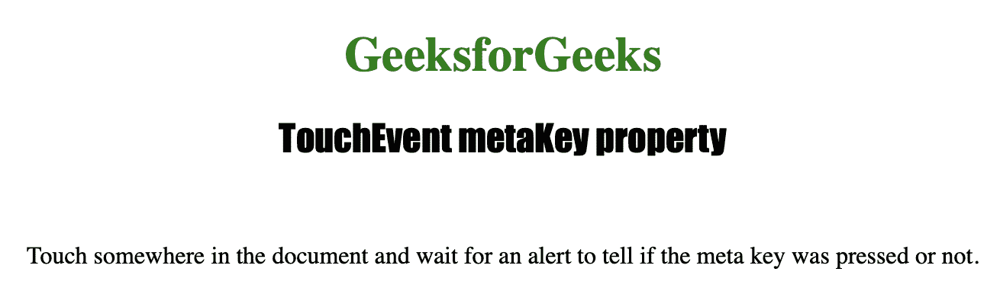
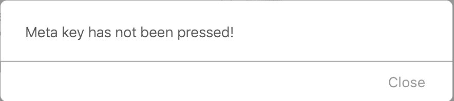

# HTML | DOM TouchEvent 元键属性

> 原文 http://www . geeksforgekes . org/html-DOM-touch event-meta key-property/

**触摸事件元键**属性是只读属性，用于返回一个**布尔**值，该值指示触摸事件触发时是否按下了*“元”*键。
它大多返回 false，因为一般来说，触摸设备没有元键。

**语法:**

```html
event.metaKey
```

**返回值:**按下元键返回真，否则返回假。

下面的程序说明了 TouchEvent 元键属性:

**示例:**查找触摸屏上是否按下了“Meta”键。

```html
<!DOCTYPE html>
<html>
<meta name="viewport" 
      content="width=device-width, 
               initial-scale=1">

<head>
    <title>TouchEvent metaKey property in HTML
    </title>

    <style>
        h1 {
            color: green;
        }

        h2 {
            font-family: Impact;
        }

        body {
            text-align: center;
        }
    </style>
</head>

<body ontouchstart="isKeyPressed(event)">

    <h1>GeeksforGeeks</h1>
    <h2>TouchEvent metaKey property</h2>
    <br>

    <p>Touch somewhere in the document and wait 
      for an alert to tell if the meta key was pressed or not.</p>

    <!-- Script to check if the meta key is pressed or not -->
    <script>
        function count(event) {
            if (event.metaKey) {
                alert("Meta key has been pressed!");
            } else {
                alert("Meta key has not been pressed!");
            }
        }
    </script>

</body>

</html>
```

**输出:**

*   **点击按钮前:**
    
*   **点击按钮后:**
    

**支持的浏览器:**

*   微软公司出品的 web 浏览器
*   谷歌 Chrome
*   火狐浏览器