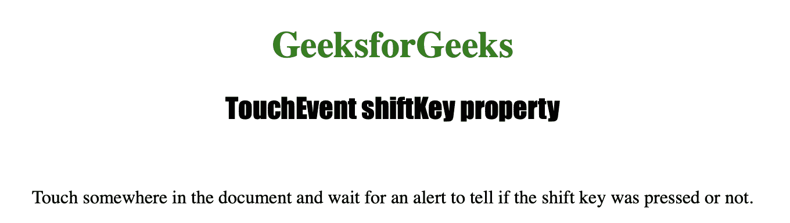
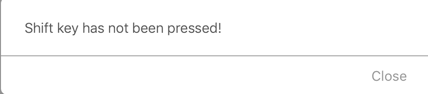

# HTML | DOM TouchEvent shiftKey 属性

> 原文:[https://www . geesforgeks . org/html-DOM-touch event-shift key-property/](https://www.geeksforgeeks.org/html-dom-touchevent-shiftkey-property/)

**触摸事件移位键**属性为只读属性，用于返回**布尔值**，该值指示触摸事件触发时是否按下了“移位”键。
touch event shiftKey 属性通常返回 false，因为一般来说，触摸设备没有 shift key。

**语法:**

```html
event.shiftKey
```

**返回值:**按下 shift 键返回真，否则返回假。

下面的程序说明了 TouchEvent shiftKey 属性:
**示例:**查找触摸屏上的**【shift】**键是否被按下。

```html
<!DOCTYPE html>
<html>
<meta name="viewport" 
      content="width=device-width, 
               initial-scale=1">

<head>
    <title>TouchEvent shiftKey property in HTML
    </title>

    <style>
        h1 {
            color: green;
        }

        h2 {
            font-family: Impact;
        }

        body {
            text-align: center;
        }
    </style>
</head>

<body ontouchstart="isKeyPressed(event)">

    <h1>GeeksforGeeks</h1>
    <h2>TouchEvent shiftKey property</h2>
    <br>

    <p>Touch somewhere in the document and wait for
      an alert to tell if the shift key was pressed or not.</p>

    <script>
        function count(event) {

            //  Check whether the shift key is 
            //  pressed or not
            if (event.shiftKey) {
                alert("Shift key has been pressed!");
            } else {
                alert("Shift key has not been pressed!");
            }
        }
    </script>

</body>

</html>
```

**输出:**

*   **点击按钮前:**
    
*   **点击按钮后:**
    

**支持的浏览器**

*   歌剧
*   微软公司出品的 web 浏览器
*   谷歌 Chrome
*   火狐浏览器
*   苹果 Safari