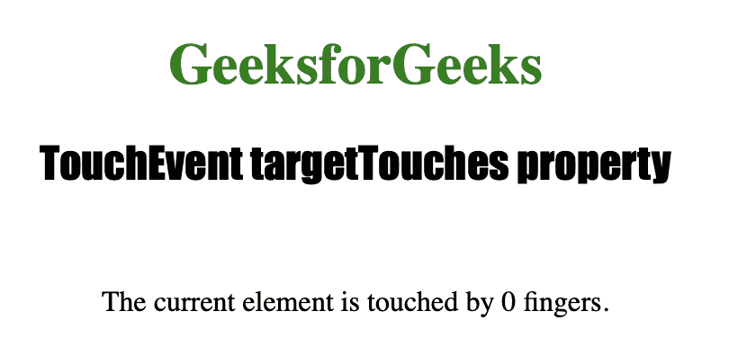
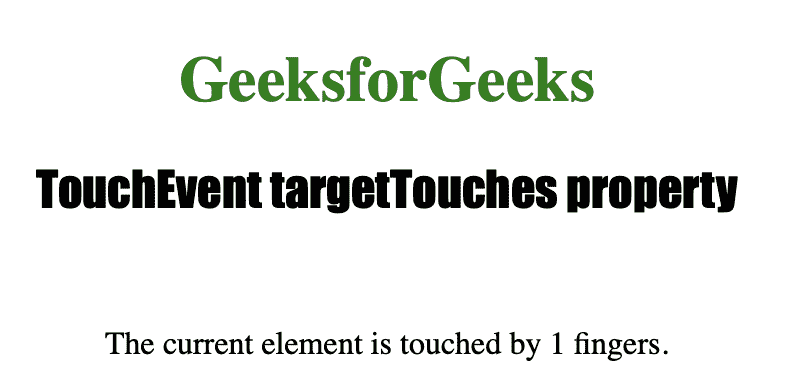

# HTML | DOM touch event target touch 属性

> 原文:[https://www . geeksforgeeks . org/html-DOM-touch event-target touches-property/](https://www.geeksforgeeks.org/html-dom-touchevent-targettouches-property/)

**触摸事件目标触摸**属性是只读属性，用于返回触摸对象的*数组*。它为接触*当前目标元素*的每个手指返回一个对象。

**语法:**

```html
event.targetTouches
```

下面的程序说明了触摸事件目标触摸属性:

**示例:**找出触摸一个元素的手指数量。

```html
<!DOCTYPE html>
<html>
<meta name="viewport" 
      content="width=device-width, initial-scale=1">

<head>
    <title> TouchEvent targetTouches property in HTML
  </title>

    <style>
        #samplediv {
            border: 1px solid green;
        }

        h1 {
            color: green;
        }

        h2 {
            font-family: Impact;
        }

        body {
            text-align: center;
        }
    </style>
</head>

<body ontouchstart="countTouches(event)" 
      ontouchend="countTouches(event)">

    <h1>GeeksforGeeks</h1>
    <h2> TouchEvent targetTouches property </h2>
    <br>

    <p>The current element is touched by 
      <span id="touch">0</span> fingers.</p>

    <script>
        function countTouches(event) {

            //  Returning touched target.
            var t = event.targetTouches.length;
            document.getElementById("touch").innerHTML =
              t;
        }
    </script>

</body>

</html>
```

**输出:**

**触摸屏幕后:**


**触摸屏幕后:**


**支持的浏览器:**

*   歌剧
*   微软公司出品的 web 浏览器
*   谷歌 Chrome
*   火狐浏览器
*   苹果 Safari