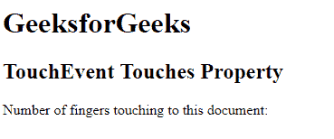
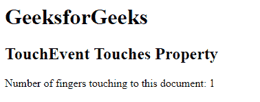

# HTML | DOM TouchEvent 触摸属性

> 原文:[https://www . geeksforgeeks . org/html-DOM-touch event-touch-property/](https://www.geeksforgeeks.org/html-dom-touchevent-touches-property/)

HTML DOM 中的 TouchEvent touches 属性用于返回触摸对象的数组。它为当前接触表面的每个手指返回一个。触摸属性是只读属性，它返回触摸对象的数组。

**语法:**

```html
event.touches
```

**返回值:**返回触摸对象的数组。

下面的程序用超文本标记语言说明了触摸事件触摸属性:

**例:**本例求手指在表面触摸的次数。

```html
<!DOCTYPE html>
<html>

<head> 
    <title>
        HTML DOM TouchEvent Touches Property
    </title>
</head>

<body ontouchstart = "touch(event)" ontouchend = "touch(event)">

    <h1>GeeksforGeeks</h1> 

    <h2>TouchEvent Touches Property</h2>

    <p>Number of fingers touching this document:
    <span id="test"></span>.

    <!-- script to colunt number of touch -->
    <script>
        function touch(event) {
            var t = event.touches.length;
            document.getElementById("test").innerHTML = t;
        }
    </script>
</body>

</html>                                                  
```

**输出:**
**触摸文档前:**

**触摸文档后:**


**支持的浏览器:**支持的浏览器*DOM touch event touch Property*如下:

*   Internet Explorer 10.0
*   谷歌 Chrome 22.0
*   Firefox 52.0