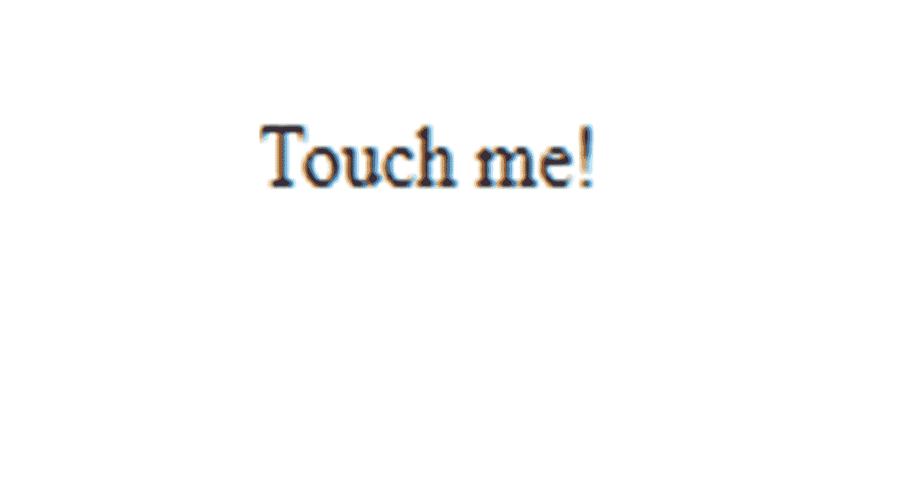
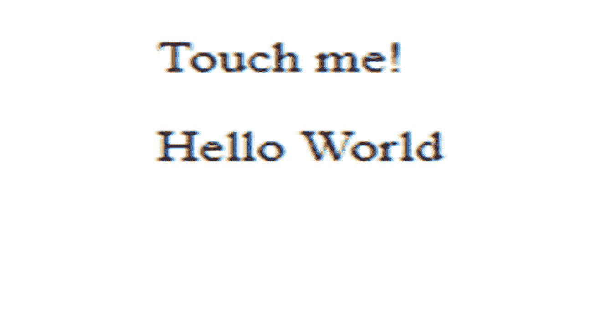
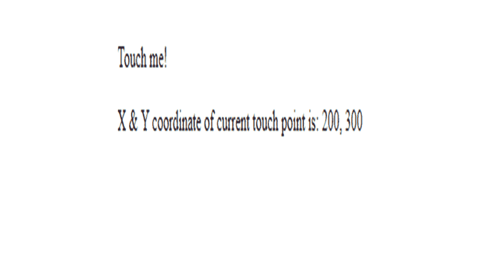

# html | DOM touch event

> 哎哎哎:# t0]https://www . geeksforgeeks . org/html-DOM-touch event/

当用户触摸基于触摸的设备时，产生的事件由**触摸事件对象**处理。触摸事件由*三类界面*组成，即**触摸**、**触摸事件**和**触摸列表**。触敏设备上的单个接触点事件由触摸界面处理。
具有带有触摸表面的接触点列表的事件，每个接触一个触摸点由触摸列表界面处理。当发送的事件中触敏表面的接触状态发生变化时，这些事件由 TouchEvent 接口处理。

**事件类型:**

1.  **ontouchstart:**When a finger is placed on a touch screen, ontouchstart event occurs.
    **Syntax:**

    ```html
    <p ontouchstart="TouchFunction()">Touch me</p>

    ```

    **示例-1:**

    ```html
    <!DOCTYPE html>
    <html>

    <head>
        <title>DOM touchstart Event</title>
    </head>

    <body>
        <p ontouchstart="TouchFunction()">Touch me!</p>
        <p id="p1"></p>
        <script>
            function TouchFunction() {

                document.getElementById(
                  "p1").innerHTML = "Hello World";
            }
        </script>

    </body>

    </html>
    ```

    **输出:**

    *   **触摸屏幕前:**
        
    *   **触摸屏幕后:**
        
2.  **ontouchmove:**When user moves finger over touch screen, ontouchmove event occurs.
    **Syntax:**

    ```html
    <p ontouchmove="TouchFunction()">Touch me</p>

    ```

    **示例-2:**

    ```html
    <!DOCTYPE html>
    <html>

    <head>
        <title>DOM touchmove Event</title>
    </head>

    <body>
        <p ontouchmove="TouchFunction()">Touch me!</p>
        <p id="p1"></p>
        <script>
            function TouchFunction() {
                var x = event.touches[0].clientX;
                var y = event.touches[0].clientY;

                document.getElementById("p1").innerHTML =
                "X & Y coordinate of current touch point is:" 
                + x + ", " + y;
            }
        </script>

    </body>

    </html>
    ```

    **输出:**

    *   **在屏幕上移动手指之前:**
        
    *   **在屏幕上移动手指后:**
        
3.  **ontouchend:**When user removes the finger from an event over touch screen, ontouchend event occurs.
    **Syntax:**

    ```html
    <p ontouchend="TouchFunction()">Touch me</p>

    ```

    **示例-3:**

    ```html
    <!DOCTYPE html>
    <html>

    <head>
        <title>DOM touchstart Event</title>
    </head>

    <body>
        <p ontouchend="TouchFunction()">Touch me!</p>
        <p id="p1"></p>
        <script>
            function TouchFunction() {
                document.getElementById(
                  "p1").innerHTML = "Hello World";
            }
        </script>

    </body>

    </html>
    ```

    **输出:**

    *   **将手指从屏幕上移开之前:**
        
    *   **将手指从屏幕上移开后:**
        

**支持的浏览器:**

*   谷歌 Chrome
*   Mozilla Firefox
*   边缘