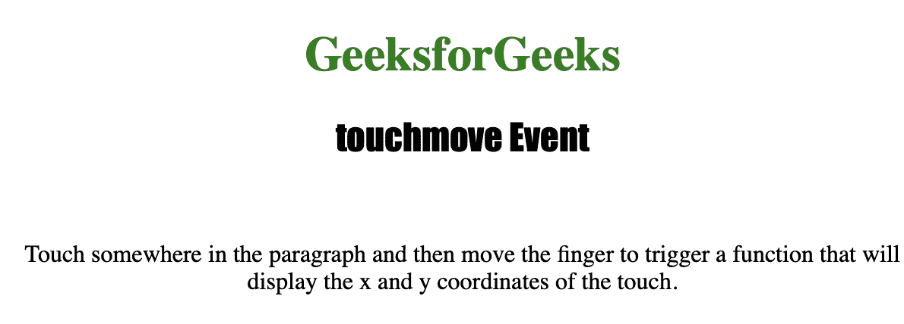
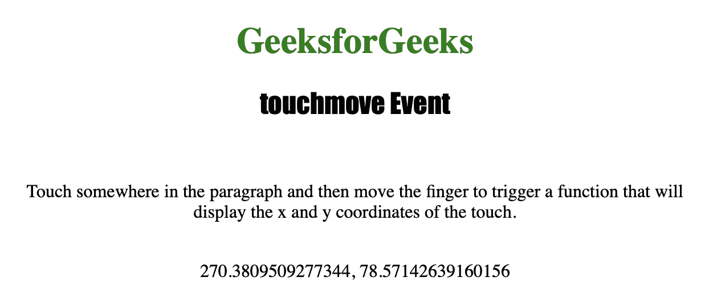

# HTML | DOM 触摸移动事件

> 原文:[https://www.geeksforgeeks.org/html-dom-touchmove-event/](https://www.geeksforgeeks.org/html-dom-touchmove-event/)

当用户在屏幕上移动手指时，**触摸移动事件**用于执行脚本。
它只在触摸屏设备上工作，每次移动触发一次，持续触发直到手指松开。
**支持的标签**

*   此事件支持的所有 HTML 元素。

**语法:**

```html
object.ontouchmove = myScript;
```

下面的程序说明了 touchmove 事件:
**示例:**当用户在 P 元素上移动手指时执行 JavaScript。

## 超文本标记语言

```html
<!DOCTYPE html>
<html>

<head>
    <title>touchmove Event in HTML</title>
    <style>
        h1 {
            color: green;
        }

        h2 {
            font-family: Impact;
        }

        body {
            text-align: center;
        }
    </style>
</head>

<body>

    <h1>GeeksforGeeks</h1>
    <h2>touchmove Event</h2>
    <br>

    <p ontouchmove="move(event)">
      Touch somewhere in the paragraph and then
      move the finger to trigger a function that
      will display the x and y coordinates of the touch.
  </p>

    <br>

    <p id="test"></p>

    <script>
        function move(event) {

            var X = event.touches[0].clientX;

            var Y = event.touches[0].clientY;

            document.getElementById(
              "test").innerHTML = X + ", " + Y;
        }
    </script>

</body>

</html>
```

**输出:**
**触屏前:**



**触摸屏幕后:**



**支持的网络浏览器**

*   微软公司出品的 web 浏览器
*   谷歌 Chrome
*   火狐浏览器