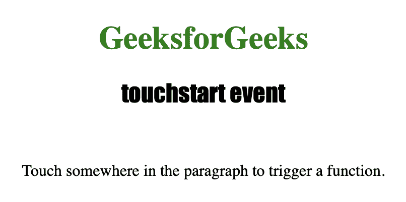
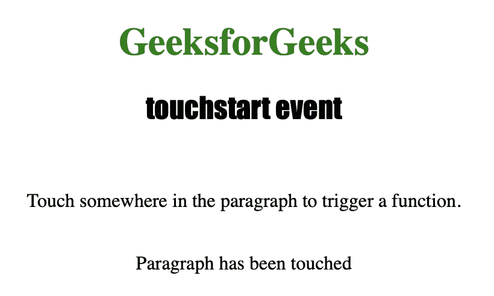

# HTML | DOM touchstart 事件

> 原文:[https://www.geeksforgeeks.org/html-dom-touchstart-event/](https://www.geeksforgeeks.org/html-dom-touchstart-event/)

每当用户触摸一个 HTML 元素时，都会使用 **touchstart** 事件来执行脚本。触摸特定元素时，如果 *touchstart* 事件与之相关联，它可以用来触发 javascript 函数。
**注**:touch start 事件仅适用于触摸屏设备。
**支持的标签**

*   所有 HTML 元素都支持此事件。

**语法:**

```html
object.ontouchstart = myScript;
```

下面的程序说明了 touchstart 事件:
**程序:**当用户触摸一个 P 元素时执行一个 JavaScript。

## 超文本标记语言

```html
<!DOCTYPE html>
<html>
<head>
    <title>touchstart event in HTML</title>
    <style>
        h1
        {
            color:green;
        }

        h2
        {
            font-family: Impact;
        }

        body
        {
            text-align:center;
        }
    </style>
</head>

<body>

    <h1>GeeksforGeeks</h1>
    <h2>touchstart event</h2><br>

    <!-- On touching this P element, the start()
        function is trigerred -->
    <p ontouchstart="start()">
        Touch somewhere in the paragraph to
        trigger a function.
    </p>

    <br>

    <p id="test"></p>

<script>
    function start()
    {
        document.getElementById("test").innerHTML =
                    "Paragraph has been touched";
    }
</script>

</body>
</html>                           
```

**输出:**



**触摸屏幕后**



**支持的网络浏览器**

*   歌剧
*   微软公司出品的 web 浏览器
*   谷歌 Chrome
*   火狐浏览器
*   苹果 Safari