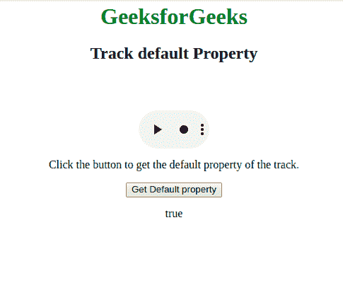

# HTML | DOM Track 默认属性

> 原文:[https://www . geesforgeks . org/html-DOM-track-default-property/](https://www.geeksforgeeks.org/html-dom-track-default-property/)

**DOM 轨迹默认属性**用于**设置**或**返回** *轨迹的默认状态*。它反映了<track>的默认属性。

**注意:**使用默认属性时，每个媒体元素不得超过一个轨道元素。

**语法:**

*   它用于返回默认属性。

    ```html
    trackObject.default
    ```

*   它还用于设置默认属性。

    ```html
    trackObject.default = true|false
    ```

**值:**要么是**真**要么是**假**显示轨迹默认状态。默认情况下，它是假的。

*   **真:**如果用户的偏好没有指示另一个音轨更合适，则音轨将被启用。
*   **假:**如果用户的偏好没有指示另一个轨道将更合适，则不启用该轨道。

**返回值:**以布尔值的形式返回轨迹的默认状态。

```html
<html>

<head>
    <style>
        body {
            text-align: center;
        }

        h1 {
            color: green;
        }
    </style>
</head>

<body>
    <h1>GeeksforGeeks</h1>
    <h2>
      Track default Property
  </h2>

    <video width="100" 
           height="100"
           controls>

        <track src=
"https://contribute.geeksforgeeks.org/wp-content/uploads/11.mp4" 
               kind="subtitles"
               srclang="en" 
               label="English" 
               default>

            <source id="myTrack" 
                    src=
"https://contribute.geeksforgeeks.org/wp-content/uploads/11.mp4" 
                    type="video/mp4">

    </video>

    <p>
      Click the button to get the 
      default property of the track.
  </p>

    <button onclick="myFunction()">
        Get Default property
    </button>

    <p id="gfg"></p>
    <!-- Script to set the default property -->
    <script>
        function myFunction() {
            var x =
                document.getElementById("myTrack");
            x.default = true;
            document.getElementById("gfg").innerHTML = 
              myTrack.default;
        }
    </script>
</body>

</html>
```

**输出:**
**点击按钮前:**


**点击按钮后:**


**支持的浏览器:**

*   谷歌 Chrome
*   Internet Explorer 10.0+
*   歌剧