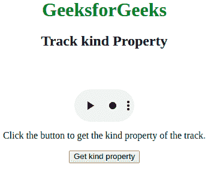
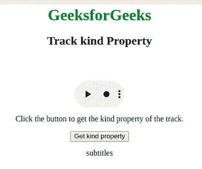

# HTML | DOM Track 种类属性

> 原文:[https://www.geeksforgeeks.org/html-dom-track-kind-property/](https://www.geeksforgeeks.org/html-dom-track-kind-property/)

**DOM 轨迹种类属性**用于**设置**或**返回** *轨迹种类属性的值*。种类属性用于指定轨道的种类。

**语法:**

*   它用于返回 kind 属性。

    ```html
    trackObject.kind
    ```

*   它也用于设置 kind 属性。

    > trackObject.kind =”字幕|元数据|章节|字幕|描述”
    > 
    > T4】

**值:**要么是**真**要么是**假**显示轨迹默认状态。默认情况下，它是假的。

*   **字幕:**定义对话和音效的翻译，也适合聋人用户。
*   **元数据:**表示脚本使用但不向用户显示的内容。
*   **章节:**定义适合导航媒体资源的章节标题。
*   **字幕:**在视频中显示字幕。
*   **descriptions:** It describe the textual description of the video content.

    **返回值:**以字符串的形式返回文本轨道的种类。

    ```html
    <html>

    <head>
        <style>
            body {
                text-align: center;
            }

            h1 {
                color: green;
            }
        </style>
    </head>

    <body>
        <h1>GeeksforGeeks</h1>
        <h2>Track kind Property</h2>

        <video width="100" 
               height="100"
               controls>

            <track src=
    "https://contribute.geeksforgeeks.org/wp-content/uploads/11.mp4"
                   id="myTrack" 
                   kind="subtitles" 
                   srclang="en" 
                   label="English" 
                   default>

                <source id="myTrack2"
                        src=
    "https://contribute.geeksforgeeks.org/wp-content/uploads/11.mp4"
                        type="video/mp4">

        </video>

        <p>
          Click the button to get the kind 
          property of the track.
      </p>

        <button onclick="myFunction()">
            Get kind property
        </button>

        <p id="gfg"></p>
        <!-- Script to get the kind property -->
        <script>
            function myFunction() {
                var x = document.getElementById(
                  "myTrack").kind;
                document.getElementById(
                  "gfg").innerHTML = x;
            }
        </script>
    </body>

    </html>
    ```

    **输出:**
    **点击按钮前:**
    

    **点击按钮后:**
    

    **支持的浏览器:**

    *   谷歌 Chrome
    *   Internet Explorer 10.0+
    *   歌剧