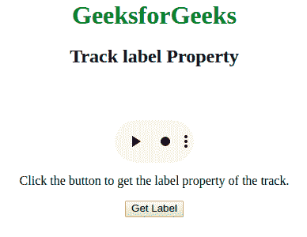
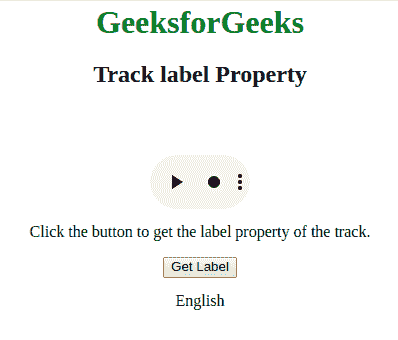
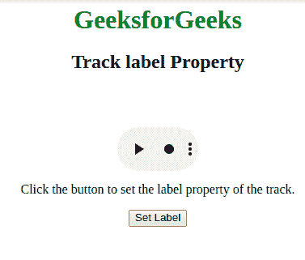
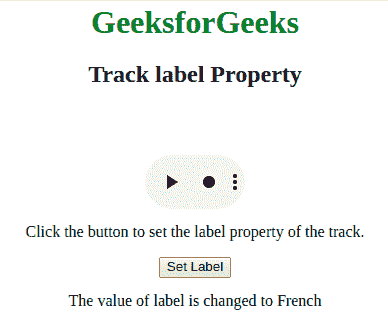

# HTML | DOM 轨迹标签属性

> 原文:[https://www . geesforgeks . org/html-DOM-track-label-property/](https://www.geeksforgeeks.org/html-dom-track-label-property/)

**DOM 轨道标签属性**用于**设置**或**返回** *轨道标签属性的值*。它用于指定文本轨道的标签。

**语法:**

*   它用于返回标签属性。

    ```html
    trackObject.label
    ```

*   它还用于设置 label 属性。

    ```html
    trackObject.label = label
    ```

**值:**

*   **标签:**用于指定文本轨道的标题。

**返回值:**以字符串的形式返回曲目的标签。

**示例:**到**获取标签属性**的值。

```html
<html>

<head>
    <style>
        body {
            text-align: center;
        }

        h1 {
            color: green;
        }
    </style>
</head>

<body>
    <h1>GeeksforGeeks</h1>
    <h2>Track label Property</h2>

    <video width="100"
           height="100"
           controls>

        <track src=
"https://contribute.geeksforgeeks.org/wp-content/uploads/11.mp4" 
               id="myTrack1" 
               kind="subtitles" 
               srclang="en" 
               label="English" 
               default>

            <source id="myTrack" 
                    src=
"https://contribute.geeksforgeeks.org/wp-content/uploads/11.mp4" 
                    type="video/mp4">

    </video>

    <p>Click the button to get the
      label property of the track.</p>

    <button onclick="myFunction()">
        Get Label
    </button>

    <p id="gfg"></p>
    <!-- Script to get the label value -->
    <script>
        function myFunction() {
            var x = 
               document.getElementById("myTrack1");

            document.getElementById(
              "gfg").innerHTML = x.label;
        }
    </script>
</body>

</html>
```

**输出:**
**点击按钮前:**


**点击按钮后:**


**示例-2:** 至**设置标签属性**的值。

```html
<html>

<head>
    <style>
        body {
            text-align: center;
        }

        h1 {
            color: green;
        }
    </style>
</head>

<body>
    <h1>GeeksforGeeks</h1>
    <h2>Track label Property</h2>

    <video width="100" 
           height="100" 
           controls>

        <track src=
"https://contribute.geeksforgeeks.org/wp-content/uploads/11.mp4" 
               id="myTrack1" 
               kind="subtitles" 
               srclang="en"
               label="English">

            <source id="myTrack"
                    src=
"https://contribute.geeksforgeeks.org/wp-content/uploads/11.mp4"
                    type="video/mp4">

    </video>

    <p>Click the button to set the
      label property of the track.</p>

    <button onclick="myFunction()">
        Set Label
    </button>

    <p id="gfg"></p>
    <!-- Script to set the label value -->
    <script>
        function myFunction() {
            var x = 
                document.getElementById("myTrack1");

            x.label = "French";

            document.getElementById("gfg").innerHTML = 
              "The value of label is changed to " + myTrack1.label;
        }
    </script>
</body>

</html>
```

**输出:**
**点击按钮前:**


**点击按钮后:**


**支持的浏览器:**

*   谷歌 Chrome
*   Internet Explorer 10.0+
*   歌剧