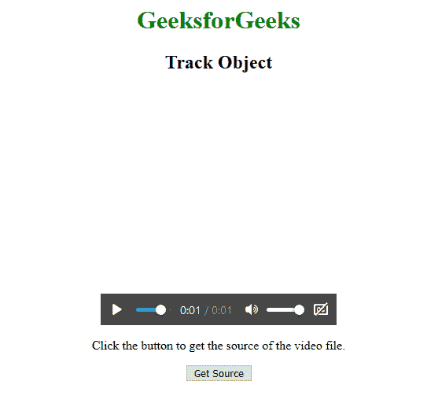
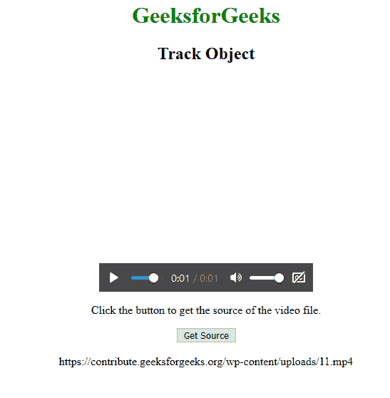

# HTML | DOM 轨迹对象

> 原文:[https://www.geeksforgeeks.org/html-dom-track-object/](https://www.geeksforgeeks.org/html-dom-track-object/)

HTML 中的 Track 对象表示一个 HTML 元素。
**访问轨迹对象:**
可以使用 getElementById()方法访问轨迹对象。
此方法用于返回具有 ID 属性的元素。

```html
var x = document.getElementById("Track");
```

**创建轨迹对象:**
可以使用 document.createElement()方法创建轨迹对象。
此方法用于创建具有指定名称的元素节点。

```html
var x = document.createElement("Track");
```

**轨迹对象的属性**

1.  **默认:**返回轨道的默认状态。
    **语法:**

```html
var x = document.getElementById("myTrack").Default;
```

1.  **种类:**返回轨迹的种类属性的值。
    **语法:**

```html
var x = document.getElementById("myTrack").kind;
```

1.  **标签:**返回轨迹的标签属性值。
    **语法:**

```html
var x = document.getElementById("myTrack").label;
```

1.  **readyState:** 返回轨道资源的当前状态。
    **语法:**

```html
var x = document.getElementById("myTrack").readyState;
```

1.  **src:** 返回轨迹的 src 属性值。
    **语法:**

```html
var x = document.getElementById("myTrack").src;
```

1.  **srclang:** 返回轨道的 srclang 属性的值。
    **语法:**

```html
var x = document.getElementById("myTrack").srclang;
```

1.  **轨迹:**它返回一个表示轨迹元素的文本轨迹数据的 TextTrack 对象。
    **语法:**

```html
var x = document.getElementById("myTrack").track;
```

**示例:**

## 超文本标记语言

```html
<html>

<head>
    <style>
        body {
            text-align: center;
        }

        h1 {
            color: green;
        }
    </style>
</head>

<body>
    <h1>GeeksforGeeks</h1>
    <h2>Track Object</h2>

    <video width="300"
           height="300"
           controls>

        <track src=
"https://write.geeksforgeeks.org/wp-content/uploads/11.mp4"
               kind="subtitles"
               srclang="en"
               label="English">

            <source id="myTrack"
                    src=
"https://write.geeksforgeeks.org/wp-content/uploads/11.mp4"
                    type="video/mp4">

            <source src=
"https://write.geeksforgeeks.org/wp-content/uploads/11.ogg"
                    type="video/ogg">
      Your browser does not support the video element.
    </video>

<p>Click the button to get
      the source of the video file.</p>

    <button onclick="myFunction()">
      Get Source
  </button>

    <p id="demo"></p>

    <script>
        function myFunction() {
            var x = document.getElementById(
              "myTrack").src;
            document.getElementById(
              "demo").innerHTML = x;
        }
    </script>
</body>

</html>
```

**输出:**
**前:**



**之后:**



**支持的浏览器:**

*   谷歌 Chrome
*   Mozilla Firefox
*   边缘
*   旅行队
*   歌剧