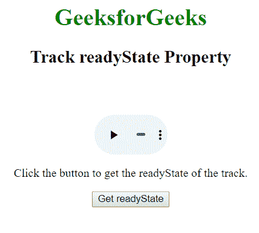

# HTML | DOM Track readyState 属性

> 原文:[https://www . geesforgeks . org/html-DOM-track-readystate-property/](https://www.geeksforgeeks.org/html-dom-track-readystate-property/)

**DOM 轨道就绪状态属性**用于**返回**轨道当前就绪状态的值。它是只读属性，就绪状态表示轨道是否准备好播放。

**语法:**

```html
trackObject.readyState
```

**返回值:**返回一个数字，代表曲目是否准备好播放。

*   0 =无= >这意味着尚未获得文本轨道
*   1 = LOADING = >这意味着文本轨道加载没有错误，仍然可以通过解析器向轨道添加更多提示。
*   2 =已加载= >这意味着文本轨道已加载，没有错误。
*   3 =错误= >这意味着文本轨道已启用，但当用户试图获取它时出现了故障。

**示例:**

```html
<!DOCTYPE html>
<html>

<head>
    <title>
        HTML DOM Track readyState Property
    </title>
</head>

<body style="text-align:center;">

    <h1 style="color:green;">
        GeeksforGeeks
    </h1>

    <h4>Track readyState Property</h4>

    <video width="100" height="100" controls>

        <track src=
"https://contribute.geeksforgeeks.org/wp-content/uploads/11.mp4"
            id="myTrack1" kind="subtitles"
            srclang="en" label="English">

        <source id="myTrack" src=
"https://contribute.geeksforgeeks.org/wp-content/uploads/11.mp4"
                    type="video/mp4">

    </video>

    <p>
        Click the button to get the
        readyState of the track.
    </p>

    <button onclick="myFunction()">
        Get readyState
    </button>

    <p id="gfg"></p>

    <!-- Script to get readyState property -->
    <script>
        function myFunction() {
            var x = document.getElementById("myTrack1");

            document.getElementById("gfg").innerHTML
                        = x.readyState;
        }
    </script>
</body>

</html>
```

**输出:**

*   点击按钮前:
    
*   点击按钮后:
    

**支持的浏览器:****HTML DOM Track readyState 属性**支持的浏览器如下:

*   谷歌 Chrome
*   Internet Explorer 10.0+
*   歌剧