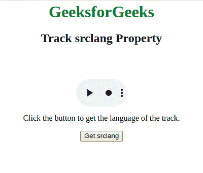
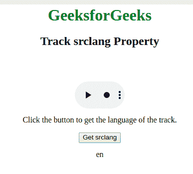

# HTML | DOM Track srclang 属性

> 原文:[https://www . geesforgeks . org/html-DOM-track-Sr clang-property/](https://www.geeksforgeeks.org/html-dom-track-srclang-property/)

**DOM track srclang 属性**用于**设置**或**返回***srclang 属性的值，该属性显示文本轨道的语言*。

**注意:**T2 属性为必填项，kind =“字幕”

**语法:**

*   它用于返回默认属性。

    ```html
    trackObject.srclang
    ```

*   它还用于设置默认属性。

    ```html
    trackObject.srclang = language_code
    ```

**值:**

*   **language_code:** 用于指定文本轨道的语言。这是一个两个字母的代码。

**返回值:**以字符串形式返回曲目的语言代码。

**示例:**

```html
<html>

<head>
    <style>
        body {
            text-align: center;
        }

        h1 {
            color: green;
        }
    </style>
</head>

<body>
    <h1>GeeksforGeeks</h1>
    <h2>Track srclang Property</h2>

    <video width="100" 
           height="100"
           controls>

        <track src=
"https://contribute.geeksforgeeks.org/wp-content/uploads/11.mp4"
               id="myTrack1"
               kind="subtitles" 
               srclang="en"
               label="English">

            <source id="myTrack" 
                    src=
"https://contribute.geeksforgeeks.org/wp-content/uploads/11.mp4" 
                    type="video/mp4">

    </video>

    <p>Click the button to get
      the language of the track.</p>

    <button onclick="myFunction()">
        Get srclang
    </button>

    <p id="gfg"></p>
    <!-- Script to get srclang property -->
    <script>
        function myFunction() {
            var x = 
                document.getElementById("myTrack1");
            document.getElementById(
              "gfg").innerHTML = x.srclang;
        }
    </script>
</body>

</html>
```

**输出:**
**点击按钮前:**


**点击按钮后:**


**支持的浏览器:**

*   谷歌 Chrome
*   Internet Explorer 10.0+
*   歌剧