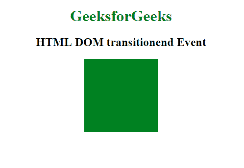
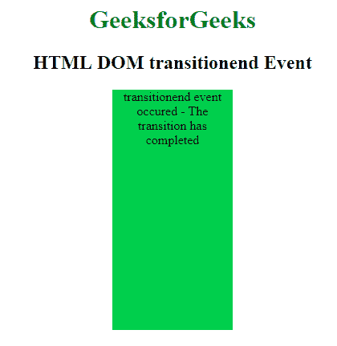

# HTML | DOM 过渡事件

> 哎哎哎:# t0]https://www . geeksforgeeks . org/html-DOM-transitional event/

当 CSS 转换结束时，会发生 HTML DOM 中的**转换和事件**。如果用户在完成前删除了转换，事件将不会触发。

**语法:**

*   Safari 3.1 到 6.0 的代码:

    ```html
    object.addEventListener("webkitTransitionEnd", Script);
    ```

*   标准语法:

    ```html
    object.addEventListener("transitionend", Script);
    ```

**示例:**

```html
<!DOCTYPE html>
<html>

<head>
    <title>HTML DOM transitionend Event</title>
    <style>
        #divID {
            width: 150px;
            height: 150px;
            background: green;
            -webkit-transition: height 1s;
            transition: height 1s;
        }

        #divID:hover {
            height: 300px;
        }
    </style>
</head>

<body>

    <center>
        <h1 style="color:green">GeeksforGeeks</h1>
        <h2>HTML DOM transitionend Event</h2>
        <div id="divID"></div>
    </center>
    <script>
        // Code for Safari 3.1 to 6.0
        document.getElementById(
          "divID").addEventListener("webkitTransitionEnd", GFGfun);

        // Standard syntax
        document.getElementById(
          "divID").addEventListener("transitionend", GFGfun);

        function GFGfun() {
            this.innerHTML = 
              "transitionend event occured - The transition has completed";
            this.style.backgroundColor = "limegreen";
        }
    </script>

</body>

</html>
```

**输出:**
**前:**


**之后:**


**支持的浏览器:****DOM transitioned 和 Event** 支持的浏览器如下:

*   Google chrome*26.0/4.0(webkittransiented)*
*   Internet Explorer *10.0*
*   Firefox*16.0/4.0(moztransitional)*
*   apple safari*6.1/3.1(webkittransiented)*
*   作业〔t1〕12.1/10.5(其他焦虑)〔t1〕