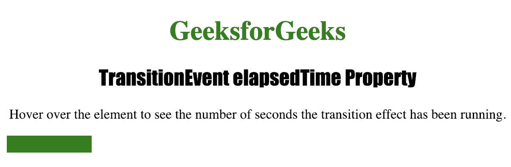

# HTML | DOM TransitionEvent elapsedTime 属性

> 原文:[https://www . geesforgeks . org/html-DOM-transionevet-elapsedtime-property/](https://www.geeksforgeeks.org/html-dom-transitionevent-elapsedtime-property/)

**TransitionEvent elapsedTime**属性用于返回*当*transition and 事件发生时*转换已经运行的秒数*。
**TransitionEvent elapsedTime**属性为只读属性。

**语法:**

```html
event.elapsedTime
```

**返回值:**返回一个数字，该数字代表转换运行的秒数。

下面的程序说明了 TransitionEvent elapsedTime 属性:

**示例:**找出过渡运行的秒数。

```html
<!DOCTYPE html>
<html>

<head>
    <title>TransitionEvent elapsedTime Property
   </title>

    <style>
        #div1 {
            width: 100px;
            height: 20px;
            background: green;
            transition: 3s;
        }

        #div1:hover {
            width: 300px;
        }

        h1 {
            color: green;
        }

        h2 {
            font-family: Impact;
        }

        body {
            text-align: center;
        }
    </style>
</head>

<body>

    <h1>GeeksforGeeks</h1>
    <h2>TransitionEvent elapsedTime Property</h2>

    <p>Hover over the element to see the number
      of seconds the transition effect has been running. </p>

    <div id="div1"></div>

    <script>
        document.getElementById("div1").addEventListener(
          "transitionend", myevent);

        function myevent(event) {

            // Return seconds.
            this.innerHTML = "Transition time is : " + 
              event.elapsedTime + " seconds";
        }
    </script>

</body>

</html>
```

**输出:**

*   **点击按钮前:**
    
*   **点击按钮后:**
    <video class="wp-video-shortcode" id="video-271074-1" width="640" height="360" preload="metadata" controls=""><source type="video/mp4" src="https://media.geeksforgeeks.org/wp-content/uploads/Screen-Recording-2019-01-26-at-4.15.43-PM.mp4?_=1">[https://media . geesforgeks . org/WP-content/uploads/Screen-Recording-2019-01-26-at-4 . 15 . 43-pm . MP4](https://media.geeksforgeeks.org/wp-content/uploads/Screen-Recording-2019-01-26-at-4.15.43-PM.mp4)</video>

**支持的浏览器:**

*   歌剧
*   微软公司出品的 web 浏览器
*   谷歌 Chrome
*   火狐浏览器
*   苹果 Safari