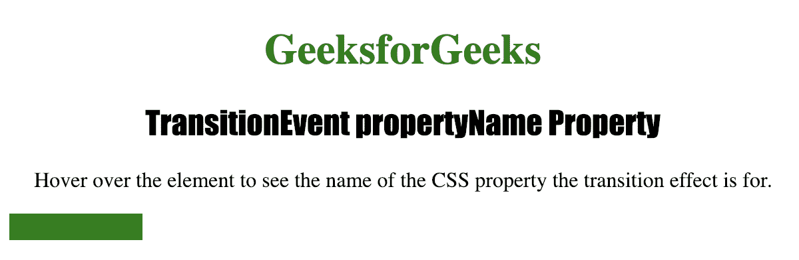

# HTML | DOM TransitionEvent Property name 属性

> 原文:[https://www . geesforgeks . org/html-DOM-transionevent-property name-property/](https://www.geeksforgeeks.org/html-dom-transitionevent-propertyname-property/)

**TransitionEvent property name**属性是一个*只读属性*，用于在发生 *transitionevent* 时返回与转换相关联的 CSS 属性的名称。

**返回值:**返回一个代表转换名称的字符串。

**语法:**

```html
event.propertyName
```

下面的程序说明了 TransitionEvent 属性名称属性:

**示例:**获取与过渡相关联的属性名称。

```html
<!DOCTYPE html>
<html>

<head>
    <title>TransitionEvent propertyName Property
  </title>

    <style>
        #MyDiv {
            width: 100px;
            height: 20px;
            background: green;
            transition: 3s;
        }

        #MyDiv:hover {
            width: 300px;
        }

        h1 {
            color: green;
        }

        h2 {
            font-family: Impact;
        }

        body {
            text-align: center;
        }
    </style>
</head>

<body>

    <h1>GeeksforGeeks</h1>
    <h2>TransitionEvent propertyName Property</h2>

    <p>Hover over the element to see the name of 
      the CSS property the transition effect is for. </p>

    <div id="MyDiv"></div>

    <script>
        document.getElementById("MyDiv").addEventListener(
          "transitionend", myevent);

        function myevent(event) {

            //  Return CSS property name.
            this.innerHTML = "CSS Property used: " + 
              event.propertyName;
        }
    </script>

</body>

</html>
```

**输出:**

**点击按钮前:**


**点击按钮后:**

<video class="wp-video-shortcode" id="video-271058-1" width="640" height="360" preload="metadata" controls=""><source type="video/mp4" src="https://media.geeksforgeeks.org/wp-content/uploads/Screen-Recording-2019-01-26-at-4.06.53-PM.mp4?_=1">[https://media.geeksforgeeks.org/wp-content/uploads/Screen-Recording-2019-01-26-at-4.06.53-PM.mp4](https://media.geeksforgeeks.org/wp-content/uploads/Screen-Recording-2019-01-26-at-4.06.53-PM.mp4)</video>

**支持的浏览器:**

*   歌剧
*   微软公司出品的 web 浏览器
*   谷歌 Chrome
*   火狐浏览器
*   苹果 Safari