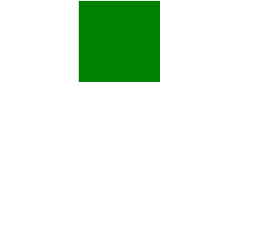
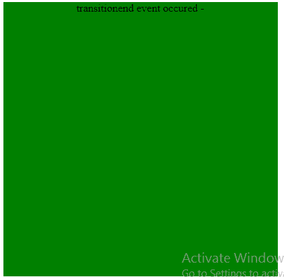
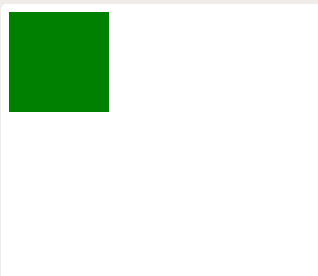
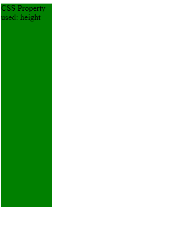

# HTML | DOM 过渡事件

> 哎哎哎:# t0]https://www . geeksforgeeks . org/html-DOM-transitional event/

创建和完成一个 **CSS 转换**会产生一个相应的 **DOM 事件**。为经历转换的每个属性触发一个事件，给出属性的名称和**转换发生的持续时间**。如果在完成之前没有执行转换，事件将不会触发。

**属性值:**

*   属性名:返回转换的名称。
*   elapsedTime:返回转换运行的秒数。

**事件类型:**

*   transitionend:当 CSS 转换完成时，该事件发生。
*   转换开始:当 CSS 转换开始时，事件发生。

**语法:**

*   **for transitionend event:**

    ```html
    object.addEventListener("transitionend", myScript);
    ```

    **示例-1:** “过渡”事件

    ```html
    <!DOCTYPE html>
    <html>

    <head>
        <style>
            #myDIV {
                width: 100px;
                height: 100px;
                background: green;
                transition: width 2s;
            }

            #myDIV:hover {
                width: 400px;
                height: 400px;
            }
        </style>
    </head>

    <body>
        <center>

            <div id="myDIV"></div>

            <script>

                // TransitionEnd Event for SAFARI.
                document.getElementById(
      "myDIV").addEventListener("webkitTransitionEnd", func);

                // TransitionEnd Event for other
                // Standard Browsers.
                document.getElementById(
      "myDIV").addEventListener("transitionend", func);

                function func() {
                  this.innerHTML = 
                   "transitionend event occured -" 
                  "The transition has completed";
                  this.style.backgroundColor = "lime green";
                }
            </script>
        </center>
    </body>

    </html>
    ```

    **输出:**

    **之前:**
    

    **之后:**
    

    **示例-2:**“TransitionEvent”property name 属性。

    ```html
    <head>
        <style>
            #myDIV {
                width: 100px;
                height: 100px;
                background: green;
                -webkit-transition: 3s;
                transition: 3s;
            }

            #myDIV:hover {
                height: 400px;

            }
        </style>
    </head>

    <body>

        <div id="myDIV"></div>

        <script>
            // Code for Safari 3.1 to 6.0
            document.getElementById("myDIV"
             ).addEventListener("webkitTransitionEnd"
                                , myFunction);

            // Standard syntax
            document.getElementById("myDIV"
             ).addEventListener("transitionend"
                                , myFunction);

            function myFunction(event) {

                // Property Name
                this.innerHTML = "CSS Property used: "
                + event.propertyName;
            }
        </script>
    </body>

    </html>
    ```

    **输出:**

    **之前:**
    

    **之后:**
    

    **支持的浏览器:**

    *   谷歌 Chrome-26.0
    *   互联网浏览器-10.0
    *   Mozilla Firefox-16.0
    *   Safari-6.1
    *   Opera-12.1