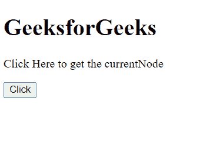
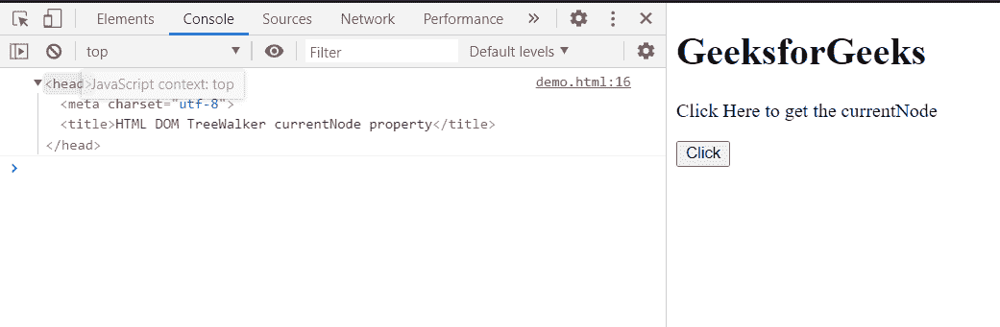
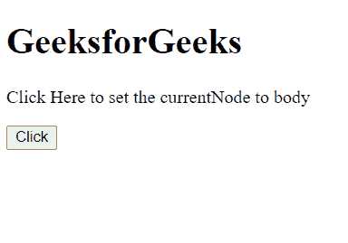
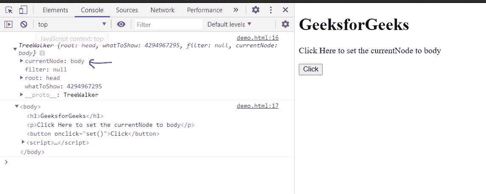

# HTML DOM tree walker current node 属性

> 原文:[https://www . geesforgeks . org/html-DOM-tree walker-current node-property/](https://www.geeksforgeeks.org/html-dom-treewalker-currentnode-property/)

**树行者当前节点**属性表示当前树行者所指向的节点。

**语法:**

*   **获取当前代码:**

    ```html
    node = treeWalker.currentNode;
    ```

*   **设置电流模式:**

    ```html
    treeWalker.currentNode = node;
    ```

**返回值:**该方法返回当前**树行者的当前节点。**

**示例 1:** 在本例中，我们将获得 TreeWalker 的 currentNode。为此，我们创建了一个树行者，节点**头，**获取当前节点。

## 超文本标记语言

```html
<!DOCTYPE html>
<html>

<body>
    <h1>GeeksforGeeks</h1>

    <p>Click Here to get the currentNode</p>

    <button onclick="get()">Click</button>

    <script>
        var treeWalker = document
            .createTreeWalker(document.head);

        function get() {
            node = treeWalker.currentNode;
            console.log(node);
        }
    </script>
</body>

</html>
```

**输出:**

*   **点击按钮前:**

    

*   **点击按钮后:**

    

**示例 2:** 在本例中，我们将创建的 TreeWalker 的 currentNode 设置为 body。

## 超文本标记语言

```html
<!DOCTYPE html>
<html>

<body>
    <h1>GeeksforGeeks</h1>

    <p>
        Click Here to set the 
        currentNode to body
    </p>

    <button onclick="set()">Click</button>

    <script>
        var treeWalker = document
            .createTreeWalker(document.head);

        function set() {
            treeWalker.currentNode = document.body;
            console.log(treeWalker);
            console.log(treeWalker.currentNode);
        }
    </script>
</body>

</html>
```

**输出:**

*   **点击按钮前:**

    

*   **点击按钮后:**

    

**支持的浏览器:**

*   谷歌 Chrome
*   边缘
*   火狐浏览器
*   旅行队
*   歌剧
*   微软公司出品的 web 浏览器