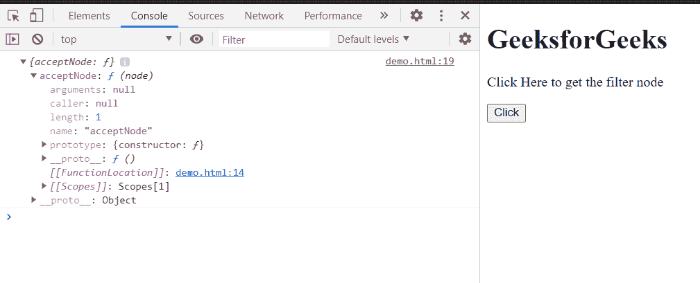

# HTML DOM 树行者过滤器属性

> 原文:[https://www . geesforgeks . org/html-DOM-tree walker-filter-property/](https://www.geeksforgeeks.org/html-dom-treewalker-filter-property/)

**树行者过滤器**属性返回一个过滤器节点，该节点是与创建的**树行者**相关联的过滤对象。它是只读属性。

创建 **TreeWalker** 时，过滤器节点或对象作为第三个参数传递，使用该属性检索。

**语法:**

```html
nodeFilter = treeWalker.filter;

```

**返回值:**该属性返回树行者的节点**过滤器**。

**示例:**在本例中，我们将使用该属性获取 TreeWalker 的节点过滤器。

## 超文本标记语言

```html
<!doctype html>
<html>

<body>
    <h1>GeeksforGeeks</h1>

    <p>Click Here to get the filter node</p>

    <button onclick="get()">Click</button>

    <script>
        var treeWalker = document.createTreeWalker
            (document.head, NodeFilter.SHOW_ELEMENT,
                {
                    acceptNode: function (node) 
                    { return NodeFilter.FILTER_ACCEPT; }
                },
                false
            );
        function get() {
            node = treeWalker.filter;
            console.log(node);
        }
    </script>
</body>

</html>
```

**输出:**

*   **点击按钮前:**

    

*   **点击按钮后:**在控制台过滤器中，可以看到节点。

    

**支持的浏览器:**

*   谷歌 Chrome
*   边缘
*   火狐浏览器
*   旅行队
*   歌剧
*   微软公司出品的 web 浏览器