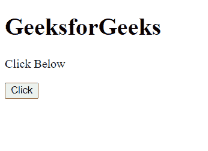
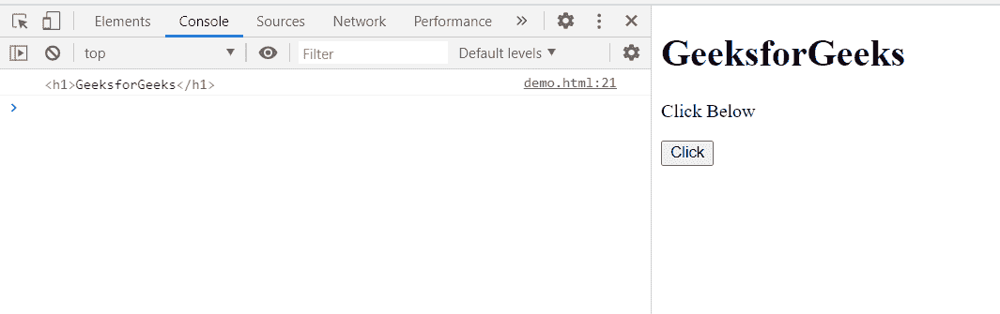

# HTML DOM treevolker next node()方法

> 原文:[https://www . geesforgeks . org/html-DOM-tree walker-next node-method/](https://www.geeksforgeeks.org/html-dom-treewalker-nextnode-method/)

**tree walker****next Node()**方法将当前节点移动到文档顺序中的**下一个可见节点**，并返回**找到的节点**。如果文档中不存在这样的子代，则该方法返回 **null** 。

**语法:**

```html
node = treeWalker.nextNode();
```

**参数:**该方法不取参数。

**返回值:**

*   如果存在，返回**下一个可见节点**。
*   如果不存在这样的子代，则返回 **null** 。

**示例:**在本例中，我创建了一个带有主体节点的 TreeWalker，因此显示了该 TreeWalker 节点的下一个可见节点。

```html
<!doctype html>
<html>
<head>
    <meta charset="utf-8">
<title>HTML DOM TreeWalker nextNode() method</title>    
</head>
<body>
    <h1>GeeksforGeeks</h1>
    <p>Click Below</p>
    <button onclick="get()">Click</button>
</body>
<script>
        var treeWalker = document.createTreeWalker(
        document.body,
        NodeFilter.SHOW_ELEMENT,
        { acceptNode: function(node) {
 return NodeFilter.FILTER_ACCEPT; } },
        false
);
        function get(){
            var node = treeWalker.nextNode();
            console.log(node) 
        }
</script>
</html>
```

**输出:**

**按钮点击前:**



**按钮点击后:**在控制台中，可以看到树行者节点的下一个可见子节点，即< h1 >标签。



**支持的浏览器:**

*   谷歌 Chrome
*   边缘
*   火狐浏览器
*   旅行队
*   歌剧
*   微软公司出品的 web 浏览器