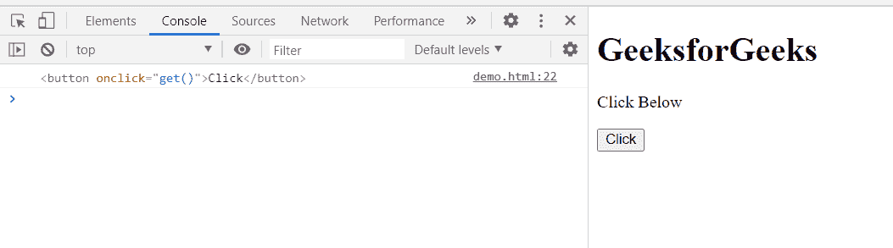

# HTML DOM tree walker previous node()方法

> 原文:[https://www . geesforgeks . org/html-DOM-tree walker-previous node-method/](https://www.geeksforgeeks.org/html-dom-treewalker-previousnode-method/)

**TreeWalker previousNode()** 方法将当前节点移动到文档顺序中的前一个可见节点，并返回找到的节点。如果文档中不存在这样的子文档，则该方法返回**空值**。

**语法:**

```html
node = treeWalker.previousNode();

```

**参数:**该方法不取参数。

**返回值:**

*   如果存在，返回**上一个可见节点**。
*   如果不存在这样的子代，则返回 **null** 。

**示例:**在本例中，创建了一个具有主体节点的 TreeWalker，并因此显示了该 TreeWalker 节点的主体节点的最后一个子节点的前一个可见节点。

## 超文本标记语言

```html
<!doctype html>
<html>

<body>
    <h1>GeeksforGeeks</h1>

    <p>Click Below</p>

    <button onclick="get()">Click</button>

    <script>
        var treeWalker = document.createTreeWalker(
            document.body,
            NodeFilter.SHOW_ELEMENT,
            {
                acceptNode: function (node) 
                { return NodeFilter.FILTER_ACCEPT; }
            },
            false
        );
        function get() {
            treeWalker.lastChild();
            var node = treeWalker.previousNode();
            console.log(node);
        }
    </script>
</body>

</html>
```

**输出:**

*   **点击按钮前:**

    

*   **点击按钮后:**在控制台中，可以看到上一个可见的 TreeWalker 节点的子节点，也就是<按钮>标签。

    

**支持的浏览器:**

*   谷歌 Chrome
*   边缘
*   火狐浏览器
*   旅行队
*   歌剧
*   微软公司出品的 web 浏览器