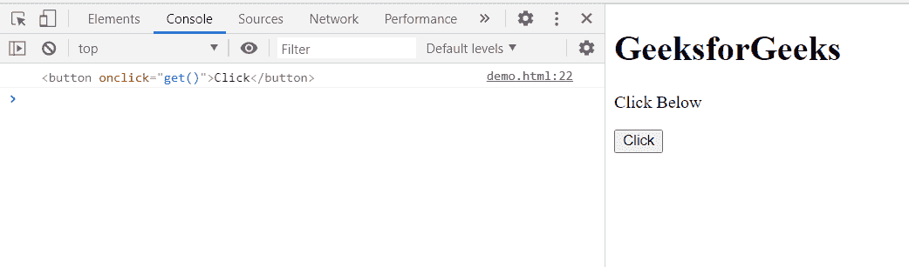

# HTML DOM tree walker previoussible()方法

> 原文:[https://www . geeksforgeeks . org/html-DOM-tree walker-previoussible-method/](https://www.geeksforgeeks.org/html-dom-treewalker-previoussibling-method/)

**TreeWalker previousSignal()**方法将当前节点移动到它的前一个兄弟节点(如果有)，并返回找到的兄弟节点。如果文档中不存在这样的子文档，则该方法返回**空值**。

**语法:**

```html
node = treeWalker.previousSibling();
```

**参数:**该方法不取参数。

**返回值:**

*   如果存在，返回当前节点先前可见的同级。
*   如果不存在这样的子代，则返回 **null** 。

**示例:**在本例中，创建了一个具有**主体**节点的树行者，因此显示了该树行者最后一个节点的先前可见的兄弟节点。

## 超文本标记语言

```html
<!DOCTYPE html>
<html>

<body>
    <h1>GeeksforGeeks</h1>

    <p>Click Below</p>

    <button onclick="get()">Click</button>

    <script>
        var treeWalker = document
            .createTreeWalker(document.body,
            NodeFilter.SHOW_ELEMENT, {
                acceptNode: function (node) 
                { return NodeFilter.FILTER_ACCEPT; }
            },
            false
        );
        function get() {
            treeWalker.lastChild();
            var node = treeWalker.previousSibling();
            console.log(node)
        }
    </script>
</body>

</html>
```

**输出:**

*   **点击按钮前:**

    

*   **点击按钮后:**在控制台中，可以看到树行者节点身体最后一个元素的前一个可见同级，即<按钮>。

    

**支持的浏览器:**

*   谷歌 Chrome
*   边缘
*   火狐浏览器
*   旅行队
*   歌剧
*   微软公司出品的 web 浏览器