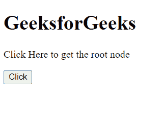
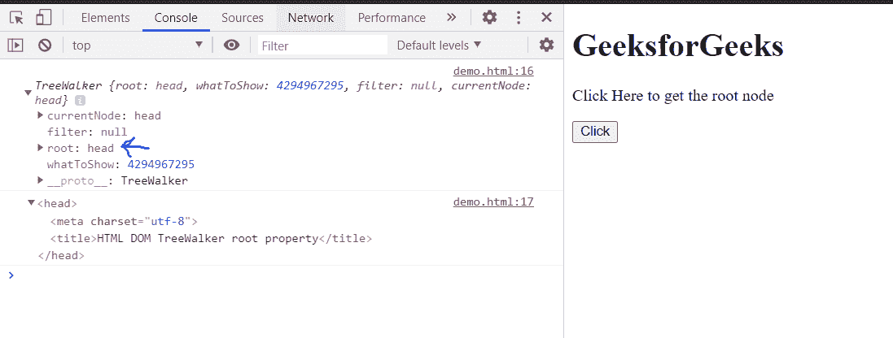

# HTML DOM TreeWalker 根属性

> 原文:[https://www . geesforgeks . org/html-DOM-tree walker-root-property/](https://www.geeksforgeeks.org/html-dom-treewalker-root-property/)

**树行者根**属性返回当前**树行者**的根节点。这是只读属性。

**语法:**

```html
rootNode = TreeWalker.root;
```

**返回值:**该属性返回**树行者的根节点。**

**示例:**在本例中，我们将学习如何使用该属性获取 TreeWalker 的 rootNode。这里，rootNode 作为参数的头节点传递，可以在控制台中进行验证。

```html
<!doctype html>
<html>
<head>
    <meta charset="utf-8">
<title>HTML DOM TreeWalker root property</title>    
</head>
<body>
    <h1>GeeksforGeeks</h1>
    <p>Click Here to get the root node</p>
    <button onclick="get()">Click</button>
</body>
<script>
        var treeWalker = document.createTreeWalker(document.head);
        function get(){
            node = treeWalker.root;
            console.log(treeWalker)
            console.log(node);
        }
</script>
</html>
```

**输出:**

**按钮点击前:**



**按钮点击后:**



**支持的浏览器:**

*   谷歌 Chrome
*   边缘
*   火狐浏览器
*   旅行队
*   歌剧
*   微软公司出品的 web 浏览器