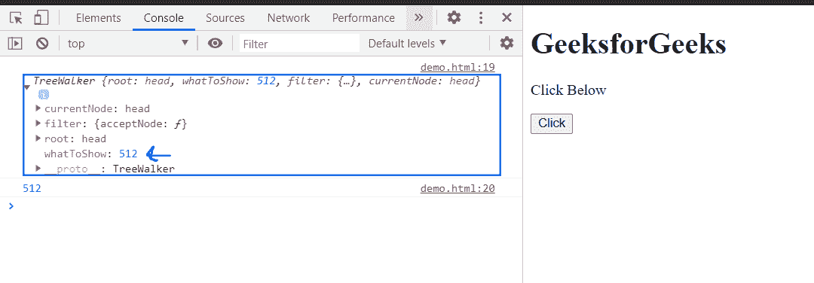

# HTML DOM tree walker whatoshow 属性

> 原文:[https://www . geesforgeks . org/html-DOM-tree walker-whatoshow-property/](https://www.geeksforgeeks.org/html-dom-treewalker-whattoshow-property/)

**tree walker WhatsToShow**属性返回一个**无符号整数**，描述必须呈现的节点类型。这是只读属性。

**语法:**

```html
whatToShow = treeWalker.whatToShow;
```

**返回值:**该属性返回一个**无符号整数，描述必须呈现的节点类型**。

以下是无符号常量的可能值。

<figure class="table">

| **恒定** | **返回值** | **常量描述** |
| NodeFilter。全部显示 | one | 显示所有节点。 |
| NodeFilter。显示评论 | One hundred and twenty-eight | 显示注释节点。 |
| NodeFilter。SHOW_DOCUMENT | Two hundred and fifty-six | 显示文档节点。 |
| NodeFilter。SHOW_DOCUMENT_FRAGMENT | One thousand and twenty-four | 显示文档片段节点。 |
| NodeFilter。显示文档类型 | Five hundred and twelve | 显示文档类型节点。 |
| NodeFilter。SHOW_ELEMENT | one | 显示元素节点。 |
| NodeFilter。显示处理指令 | Sixty-four | 显示处理指令节点。 |
| NodeFilter.SHOW_TEXT | four

 | 显示文本节点。 |

</figure>

**示例:**此示例有 NodeFilter。FILTER_ACCEPT 作为节点筛选器，因此分别返回 whatToShow 值。

```html
<!doctype html>
<html>
<head>
    <meta charset="utf-8">
<title>HTML DOM TreeWalker whatToShow property</title>    
</head>
<body>
    <h1>GeeksforGeeks</h1>
    <p>Click Below</p>
    <button onclick="get()">Click</button>
</body>
<script>
        var treeWalker = 
document.createTreeWalker(document.head,NodeFilter.SHOW_DOCUMENT_TYPE,
        { acceptNode: function(node) {
          return NodeFilter.FILTER_ACCEPT; } },
    false
);
        function get(){
            node = treeWalker.whatToShow;
            console.log(treeWalker)
            console.log(node);
        }
</script>
</html>
```

**输出:**

**按钮点击前:**


**按钮点击后:**



**支持的浏览器:**

*   谷歌 Chrome
*   边缘
*   火狐浏览器
*   旅行队
*   歌剧
*   微软公司出品的 web 浏览器