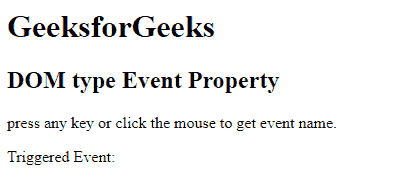
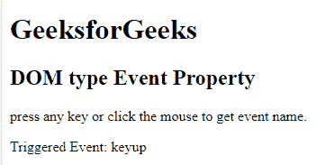

# HTML | DOM 类型事件属性

> 原文:[https://www.geeksforgeeks.org/html-dom-type-event-property/](https://www.geeksforgeeks.org/html-dom-type-event-property/)

HTML DOM 中的类型事件属性用于返回触发事件的类型。它返回一个表示事件类型的字符串。事件可以是键盘事件或鼠标事件。

**语法:**

```html
event.type
```

**返回值:**返回代表事件类型的字符串。

**示例:**

```html
<!DOCTYPE html>
<html>
    <head> 
        <title>
            HTML DOM type Event Property
        </title> 
    </head>

    <body
        onmousedown = "event_name(event)"
        onmouseup = "event_name(event)"
        onkeydown = "event_name(event)"
        onkeyup = "event_name(event)">

        <h1>GeeksforGeeks</h1> 
        <h2>DOM type Event Property</h2> 

        <p>
            press any key or click the mouse
            to get event name.
        </p>

        <p>Triggered Event: <span id = "GFG"></span></p>

        <!-- script to display event name -->
        <script>
            function event_name(event) {
                var e = event.type;
                document.getElementById("GFG").innerHTML = e;
            }
        </script>
    </body>
</html>                    
```

**输出:**
**之前点击按钮:**

**之后点击按钮:**


**支持的浏览器:***DOM 类型事件属性*支持的浏览器如下:

*   歌剧
*   Internet Explorer 9.0
*   谷歌 Chrome
*   火狐浏览器
*   苹果 Safari