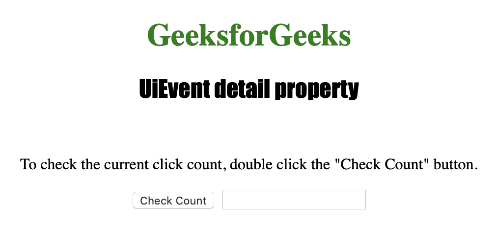
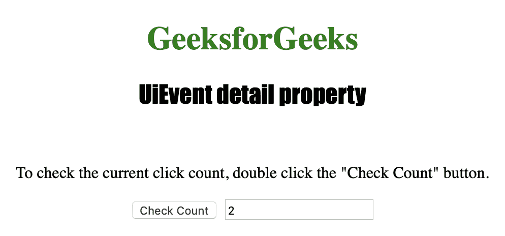

# HTML | DOM UiEvent 详细属性

> 原文:[https://www . geesforgeks . org/html-DOM-ui event-detail-property/](https://www.geeksforgeeks.org/html-dom-uievent-detail-property/)

**UiEvent detail** 属性用于返回一个带有事件详细信息的*号*。
**ui event detail**属性返回一个数字，当在 *onclick* 和*onblclick*上使用时，该数字表示*当前点击次数*，而当在 *onmousedown* 和 *onmouseup* 上使用时，该属性返回一个数字，该数字表示当前点击次数加 1。

**语法:**

```html
event.detail
```

下面的程序说明了 UiEvent 细节属性:

**示例:**找出鼠标在同一区域被点击了多少次。

```html
<!DOCTYPE html>
<html>

<head>
    <title>UiEvent detail property in HTML</title>
    <style>
        h1 {
            color: green;
        }

        h2 {
            font-family: Impact;
        }

        body {
            text-align: center;
        }
    </style>
</head>

<body>

    <h1>GeeksforGeeks</h1>
    <h2>UiEvent detail property</h2>
    <br>

    <p>To check the current click count, 
      double click the "Check Count" button.</p>

    <button ondblclick="count(event)">
        Check Count
    </button>

    <input id="clicks" type="text">

    <script>
        function count(event) {

            //  Return detail.
            var c = event.detail;
            document.getElementById("clicks").value =
                c;
        }
    </script>

</body>

</html>
```

**输出:**
**点击按钮前:**


**点击按钮后:**


**支持的浏览器:**

*   歌剧
*   微软公司出品的 web 浏览器
*   谷歌 Chrome
*   火狐浏览器
*   苹果 Safari