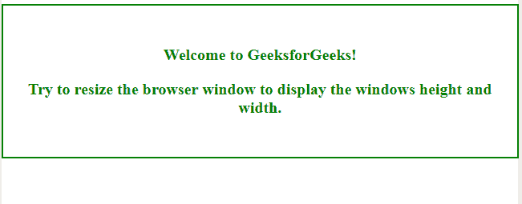
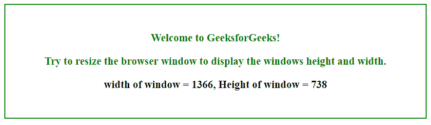
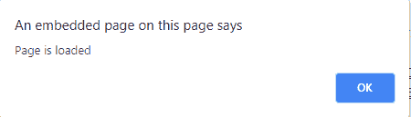

# html | DOM uievent

> 哎哎哎:# t0]https://www . geeksforgeeks . org/html-DOM-uievent/

HTML 中的 **DOM UiEvent** 是属于 UiEvent 对象的用户界面触发的事件。
用户界面事件的两个主要目的是:

*   允许注册事件侦听器，并通过树结构描述事件流。
*   提供现有浏览器中使用的当前事件系统的公共子集。

**语法:**

```html
Event_name = function

```

**返回值:**这将返回附加了指定事件的对象。

属于**事件对象**的**事件类型**有:

| **事件** | 功能 |
| 流产 | 当介质加载中止时，会发生此事件。 |
| 卸载前 | 此事件发生在文档即将卸载之前 |
| 错误 | 当加载媒体文件时发生错误时，会发生此事件。 |
| 负荷 | 当加载了对象时，会发生此事件。 |
| 调整大小 | 当调整文档视图大小时，会发生此事件。 |
| 卷起 | 当滚动元素的滚动条时，会发生此事件。 |
| 挑选 | 该事件发生在用户选择一些文本(“输入”和“文本区域”)之后。 |
| 倾销 | 一旦页面卸载(对于“正文”)，就会发生此事件。 |

**例-1:** 本例基于**【on resize】**事件。

```html
<!DOCTYPE html>
<html>
<style>
    body {
        width: 90%;
        color: green;
        border: 2px solid green;
        height: 40%;
        font-weight: bold;
        text-align: center;
        padding: 30px;
        font-size: 20px;
    }

    #demo {
        color: black;
    }
</style>

<!-- 'onresize' event -->
<body onresize="mainFunction()">
    <p>Welcome to GeeksforGeeks!</p>
    <p>Try to resize the browser window to 
       display the windows height and width.</p>

    <p id="demo"></p>

    <script>
        function mainFunction() {
            var w = window.outerWidth;
            var h = window.outerHeight;
            var txt = "width of window = " + w + 
                ", Height of window = " + h;

            document.getElementById("demo").innerHTML = txt;
        }
    </script>

</body>

</html>
```

**输出:**

**初始:**


**当窗口宽度增加到 110%时宽度和高度的值将为:**


**例-2:** 本例基于**“加载”**事件。

```html
<!DOCTYPE html>
<html>
<style>
    body {
        width: 90%;
        color: green;
        border: 2px solid green;
        height: 40%;
        font-weight: bold;
        text-align: center;
        padding: 30px;
        font-size: 20px;
    }

    #demo {
        color: black;
    }
</style>

<!-- 'onload' event. -->

<body onload="myFunction()">

    <p>Welcome to GeeksforGeeks!</p>
    <p>This page loaded.</p>

    <script>
        function myFunction() {
            alert("Page is loaded");
        }
    </script>

</body>

</html>
```

**页面加载时:**


**支持的浏览器:**

*   谷歌 Chrome
*   Mozilla Firefox
*   边缘
*   旅行队
*   歌剧