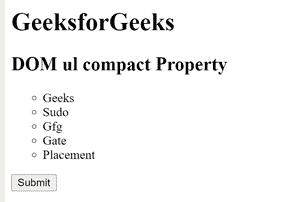
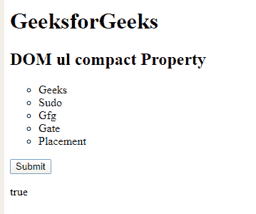
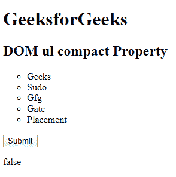

# HTML | DOM ul 紧凑属性

> 原文:[https://www.geeksforgeeks.org/html-dom-ul-compact-property/](https://www.geeksforgeeks.org/html-dom-ul-compact-property/)

**HTML DOM ul 紧凑属性**用于设置或返回< ul >标签的紧凑属性的值。compact 属性用于通过减少列表项之间的空间和列表的缩进来定义列表应小于正常值。它是一个布尔属性。

**注意:**html 5 不支持该属性。

**语法:**

*   它返回一个 ul 紧凑属性。

```html
ulObject.type
```

*   它用于设置 ul compact 属性。

```html
ulObject.compact = "True/false";
```

**属性值:**

*   **true:** 定义设置了紧凑属性。
*   **false:** 定义没有设置紧凑属性。

**返回值:**它返回一个字符串值，表示紧凑属性设置为真或假。

**例 1:**

## 超文本标记语言

```html
<!DOCTYPE html>
<html>

<head>
    <title>DOM ul compact Property</title>
</head>

<body>
    <h1>GeeksforGeeks</h1>
    <h2>DOM ul compact Property </h2>
    <ul id="Geeks" type="circle" compact>
        <!-- Assigning id to 'li tag' -->
        <li id="GFG">Geeks</li>
        <li>Sudo</li>
        <li>Gfg</li>
        <li>Gate</li>
        <li>Placement</li>
    </ul>
    <button onclick="myGeeks()">Submit</button>
    <p id="sudo"></p>

    <script>
        function myGeeks() {
            // Accessing 'ul' tag.
            var g = document.getElementById(
                "Geeks").compact;
            document.getElementById(
                "sudo").innerHTML = g;
        }
    </script>
</body>

</html>
```

**输出:**

*   **点击按钮前:**



*   **点击按钮后:**



**例 2:**

## 超文本标记语言

```html
<!DOCTYPE html>
<html>

<head>
    <title>DOM ul compact Property</title>
</head>

<body>
    <h1>GeeksforGeeks</h1>
    <h2>DOM ul compact Property </h2>
    <ul id="Geeks" type="circle" compact>
        <!-- Assigning id to 'li tag' -->
        <li id="GFG">Geeks</li>
        <li>Sudo</li>
        <li>Gfg</li>
        <li>Gate</li>
        <li>Placement</li>
    </ul>
    <button onclick="myGeeks()">Submit</button>
    <p id="sudo"></p>

    <script>
        function myGeeks() {
            // Accessing 'ul' tag.
            var g = document.getElementById(
                "Geeks").compact = "false";
            document.getElementById(
                "sudo").innerHTML = g;
        }
    </script>
</body>

</html>
```

**输出:**

*   **点击按钮前:**


*   **点击按钮后:**

