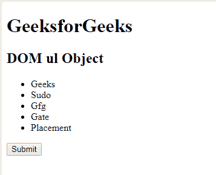
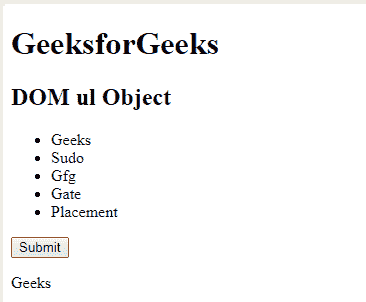
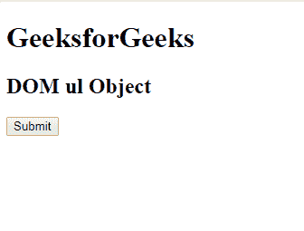
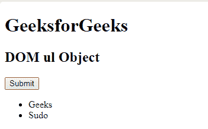

# html \ DOM ul 对象

> 原文:[https://www.geeksforgeeks.org/html-dom-ul-object/](https://www.geeksforgeeks.org/html-dom-ul-object/)

**DOM Ul 对象**用于表示 HTML < ul >元素。 *ul* 元素由 **getElementById()访问。**
**属性:**

*   [**紧凑:**](https://www.geeksforgeeks.org/html-dom-ul-compact-property/) 用于设置或返回无序列表的高度是否会渲染得比正常情况下小。

*   [**类型:**](https://www.geeksforgeeks.org/html-dom-ul-type-property/) 用于设置或返回< ul >元素的类型属性的值。

**语法:**

```html
document.getElementById("ID");
```

其中**“id”**是分配给**“ul”**标签的 ID。
**例-1:**

## 超文本标记语言

```html
<!DOCTYPE html>
<html>

<head>
    <title>DOM ul Object</title>
</head>

<body>
    <h1>GeeksforGeeks</h1>
    <h2>DOM ul Object </h2>
    <ul id="Geeks">
        <!-- Assigning id to 'li tag' -->
        <li id="GFG">Geeks</li>
        <li>Sudo</li>
        <li>Gfg</li>
        <li>Gate</li>
        <li>Placement</li>
    </ul>
    <button onclick="myGeeks()">Submit</button>
    <p id="sudo"></p>

    <script>
        function myGeeks() {
            // Accessing 'ul' tag.
            var g = document.getElementById(
              "Geeks").id;
            document.getElementById(
              "sudo").innerHTML = g;
        }
    </script>
</body>

</html>
```

**输出:**
**点击按钮前:**



**点击按钮后:**



**示例-2 :** *< ul >* 可以使用 **document.createElement** 方法创建对象。

## 超文本标记语言

```html
<!DOCTYPE html>
<html>

<head>
    <title>DOM ul Object</title>
</head>

<body>
    <h1>GeeksforGeeks</h1>
    <h2>DOM ul Object </h2>
    <button onclick="myGeeks()">Submit</button>
    <script>
        function myGeeks() {
            // 'ul' tag Created.
            var g = document.createElement("UL");
            g.setAttribute("id", "GFG");
            document.body.appendChild(g);

            var f = document.createElement("LI");
            var w = document.createTextNode("Geeks");
            f.appendChild(w);
            document.getElementById("GFG").appendChild(f);

            var x = document.createElement("LI");
            var y = document.createTextNode("Sudo");
            x.appendChild(y);
            document.getElementById("GFG").appendChild(x);
        }
    </script>
</body>

</html>
```

**输出:**
**点击按钮前:**



**点击按钮后:**



**支持的浏览器:****DOM Ul Object**支持的浏览器如下:

*   谷歌 Chrome
*   微软公司出品的 web 浏览器
*   火狐浏览器
*   歌剧
*   旅行队