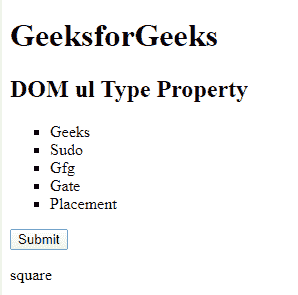

# HTML | DOM Ul 类型属性

> 原文:[https://www.geeksforgeeks.org/html-dom-ul-type-property/](https://www.geeksforgeeks.org/html-dom-ul-type-property/)

**HTML DOM Ul 类型属性**用于设置或返回一个 **< ul >元素的类型属性的值。**

**语法:**

*   它返回一个 ul 类型属性。

    ```html
    ulObject.type
    ```

*   它用于设置 ul 类型属性。

    ```html
    ulObject.type = "disc/circle/square";
    ```

**属性值:**

*   **盘:**默认。实心圆。
*   **圆圈:**未填充的圆圈
*   **方块**一个填充的方块。

**示例:**

```html
<!DOCTYPE html> 
<html> 

<head> 
    <title>DOM ul Type Property</title> 
</head> 

<body> 
    <h1>GeeksforGeeks</h1> 
    <h2>DOM ul Type Property </h2> 
    <ul id="Geeks" type="circle"> 
        <!-- Assigning id to 'li tag' -->
        <li id="GFG">Geeks</li> 
        <li>Sudo</li> 
        <li>Gfg</li> 
        <li>Gate</li> 
        <li>Placement</li> 
    </ul> 
    <button onclick="myGeeks()">Submit</button> 
    <p id="sudo"></p> 
    <script> 
        function myGeeks() { 
            // Accessing 'ul' tag. 
            var g = document.getElementById( 
            "Geeks").type; 
            document.getElementById( 
            "sudo").innerHTML = g; 
        } 
    </script> 
</body> 

</html> 
```

**输出:**
**点击按钮前:**

**点击按钮后:**


**例 2:**

```html
<!DOCTYPE html> 
<html> 

<head> 
    <title>DOM ul Type Property</title> 
</head> 

<body> 
    <h1>GeeksforGeeks</h1> 
    <h2>DOM ul Type Property </h2> 
    <ul id="Geeks" type="circle"> 
        <!-- Assigning id to 'li tag' -->
        <li id="GFG">Geeks</li> 
        <li>Sudo</li> 
        <li>Gfg</li> 
        <li>Gate</li> 
        <li>Placement</li> 
    </ul> 
    <button onclick="myGeeks()">Submit</button> 
    <p id="sudo"></p> 
    <script> 
        function myGeeks() { 
            // Accessing 'ul' tag. 
            var g = document.getElementById( 
            "Geeks").type ="square"; 
            document.getElementById( 
            "sudo").innerHTML = g; 
        } 
    </script> 
</body> 

</html> 
```

**输出:**
**点击按钮前:**

**点击按钮后:**


**支持的浏览器:****HTML DOM ul 类型属性**支持的浏览器如下:

*   谷歌 Chrome
*   微软公司出品的 web 浏览器
*   火狐浏览器
*   旅行队
*   歌剧