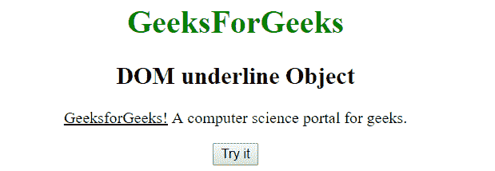
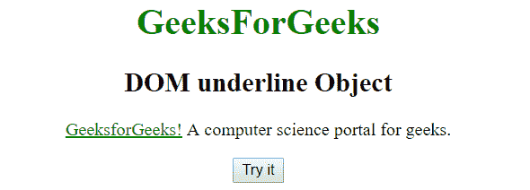
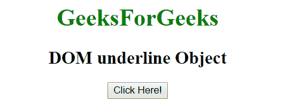
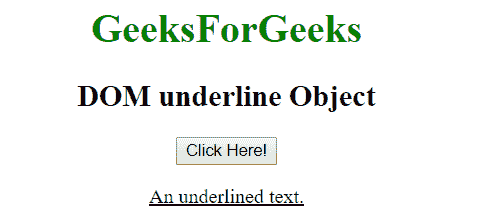

# HTML | DOM 下划线对象

> 原文:[https://www.geeksforgeeks.org/html-dom-underline-object/](https://www.geeksforgeeks.org/html-dom-underline-object/)

DOM 下划线对象用于表示 HTML u 元素。下划线元素由 getElementById()访问。

**语法:**

```html
document.getElementById("id"); 
```

其中‘id’是分配给<u>标签的 ID。</u> 

**例 1:**

## 超文本标记语言

```html
<!DOCTYPE html>
<html>
    <head>
        <title>
            HTML DOM underline Object
        </title>
    </head>

    <body style = "text-align:center;">

        <h1 style = "color:green;" >
            GeeksForGeeks
        </h1>

        <h2>DOM underline Object</h2>

<p><u id = "u">GeeksforGeeks!</u> A computer
        science portal for geeks.</p>

        <button onclick = "Geeks()">
            Click Here!
        </button>

        <script>
            function Geeks() {
                var txt = document.getElementById("u");
                txt.style.color = "green";
            }
        </script>
    </body>
</html>                   
```

**输出:**
**之前点击按钮:**



**点击按钮后:**



**示例 2:** 可以使用 document.createElement 方法创建下划线对象。

## 超文本标记语言

```html
<!DOCTYPE html>
<html>
    <head>
        <title>
            HTML DOM underline Object
        </title>
    </head>

    <body style = "text-align:center">

        <h1 style = "color:green;" >
            GeeksForGeeks
        </h1>

        <h2>DOM underline Object</h2>

        <button onclick = "Geeks()">
            Click Here!
        </button>

        <p id = "p"></p>

        <script>
            function Geeks() {
                var txt = document.createElement("U");
                var t = document.createTextNode("An underlined text.");
                txt.appendChild(t);
                document.getElementById("p").appendChild(txt);
            }
        </script>
    </body>
</html>                   
```

**输出:**
**之前点击按钮:**



**点击按钮后:**



**支持的浏览器:**

*   谷歌 Chrome
*   Mozilla Firefox
*   边缘
*   旅行队
*   歌剧