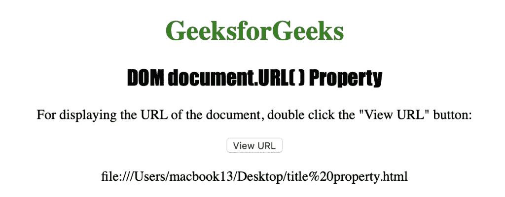

# HTML DOM URL 属性

> 原文:[https://www.geeksforgeeks.org/html-dom-url-property/](https://www.geeksforgeeks.org/html-dom-url-property/)

**示例:**在本例中，我们只需使用 DOM URL 属性显示 GeeksforGeeks URL。

## 超文本标记语言

```html
<!DOCTYPE html>
<html>

<body>
  <h2>GeeksforGeeks</h2>
  <p id="GfG">
    GeeksforGeeks URL:<br/>
    <span id="GfG">https://www.geeksforgeeks.org/</span>
  </p>

  <script>
    document.getElementById("https://www.geeksforgeeks.org/")
      .textContent = document.URL;
  </script>
</body>

</html>
```

**输出:**


HTML 中的 **URL 属性**用于返回包含当前文档完整 URL 的字符串。该字符串还包括 HTTP 协议，例如(http://)。
**语法:**

```html
document.URL
```

**返回值:**返回一个字符串值，代表文档的完整 URL。

以下示例说明了该文档。HTML 中的 URL 属性
**示例:**

## 超文本标记语言

```html
<!DOCTYPE html>
<html>

<head>
    <title>DOM document.URL() Property</title>
    <style>
    h1 {
        color: green;
    }

    h2 {
        font-family: Impact;
    }

    body {
        text-align: center;
    }
    </style>
</head>

<body>
    <h1>GeeksforGeeks</h1>
    <h2>DOM document.URL() Property</h2>
    <p>
      For displaying the URL of the document, 
      double click the "View URL" button: 
    </p>

    <button ondblclick="myURL()">View URL</button>
    <p id="url"></p>

    <script>
        function myURL() {
            var gfg = document.URL;
            document.getElementById("url").innerHTML = gfg;
        }
    </script>
</body>

</html>
```

**输出:**



**支持的浏览器:**

*   谷歌 Chrome
*   微软公司出品的 web 浏览器
*   火狐浏览器
*   歌剧
*   苹果 Safari