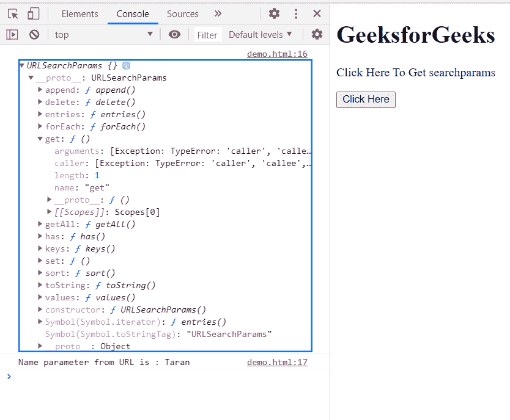

# HTML DOM URL 搜索参数属性

> 原文:[https://www . geesforgeks . org/html-DOM-URL-search params-property/](https://www.geeksforgeeks.org/html-dom-url-searchparams-property/)

**搜索参数**属性返回一个**URL 搜索参数对象**，允许访问获取 URL 中包含的所有解码的查询参数。

**语法:**

```html
params = url.searchParams;
```

**返回值:**一个**URL 搜索参数**对象。

**示例:**在这个示例中，我们将获得 URL 的 searchParams，这里的 URL 是"https://gfg.com/？以“塔兰”为例。

在这个网址中，我们将使用这个属性获取名称参数。

```html
<!doctype html>
<html>
<head>
    <meta charset="utf-8">
<title>HTML DOM URL searchParams property</title>    
</head>
<body>
    <h1>GeeksforGeeks</h1>
    <p>Click Here To Get searchparams</p>
    <button onclick="Check()">Click Here</button>
    <div class="child"></div>
</body>
<script>
    function Check(){
         let params = (new URL(
            "https://gfg.com/?name=Taran")).searchParams;
                console.log(params);
                console.log(
      "Name parameter from URL is :", params.get("name"));
        }
</script>
</html>
```

**输出:**

**按钮点击前:**


**按钮点击后:**



**支持的浏览器:**

*   谷歌 Chrome
*   边缘
*   火狐浏览器
*   旅行队
*   歌剧